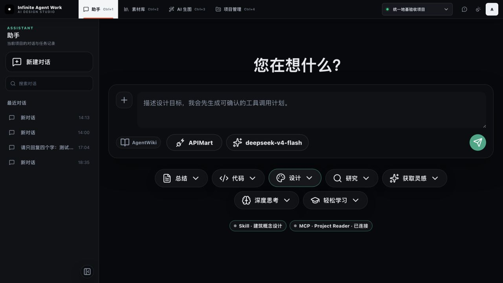
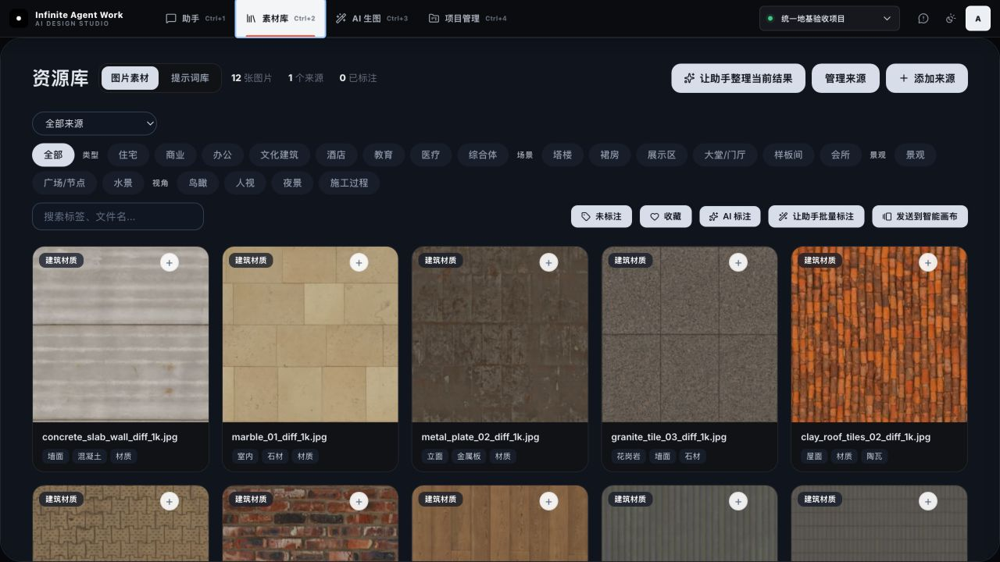
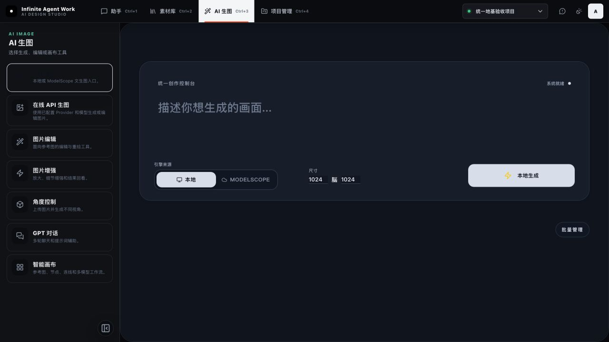
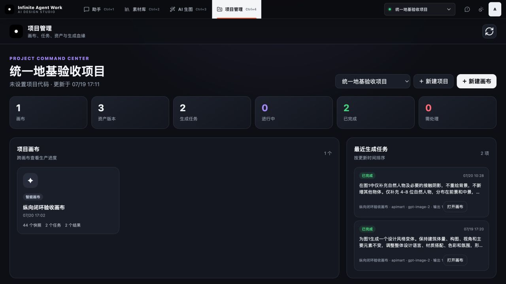
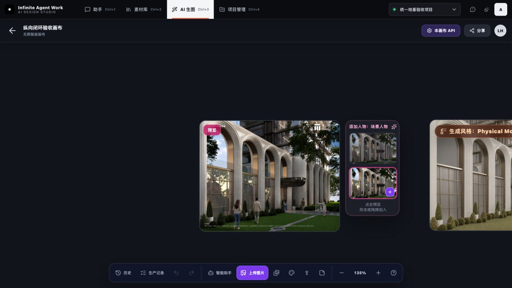

# Infinite Agent Work 上下文回头验收

日期：2026-07-20

## 审计范围

本轮按“统一外壳 → 素材库 → AI 生图 → 项目管理 → 智能画布 → Agent Runtime → Skills/MCP”重新验收。只判断已经完成的能力是否真实闭环，不新增业务功能。

## 总体结论

第一阶段的产品骨架已经成立：统一顶部导航、项目选择器、素材库、AI 生图工具入口、项目工作台、智能画布、项目资产与生成任务都能在真实页面中工作；设计 Agent 也已经有真实工具调用循环、Skill 约束和 MCP 调用。

但现在还不能把它称为“稳定的项目级 Agent 平台”。继续扩功能前，应先修复项目上下文、权限边界、项目级记忆和完成条件四个问题。

## 最高优先级问题

### P0-1 Agent 没有继承顶部当前项目

- 顶部项目选择器把项目 ID 写入 `studio_active_project_id`。
- 助手首页的 `buildAgentContext()` 没有读取这个值，也没有发送 `project_id`。
- 后端 `resolve_project_id()` 在缺少项目 ID 时回落到默认项目。
- 现有真实任务 `agent_d440ee91f47c42d3b3120d6d87a34a0b` 的结果已经显示 `project_id: project_default`。

影响：用户明明处于“统一地基验收项目”，Agent 新建的画布、素材或设计产物仍可能进入默认项目。

### P0-2 本地服务的安全边界过宽

- 服务监听 `0.0.0.0:3000`。
- CORS 允许任意来源。
- Agent、项目、素材、配置写入接口没有身份校验。
- `/api/config/token` 会返回完整 ModelScope Token。

影响：同一局域网或恶意网页可能访问本地接口。若未来接入更多 MCP/Skills，这个风险会进一步放大。

### P0-3 “需确认”没有后端强制执行

- 计划会计算 `requires_confirmation`，界面也会标记写入步骤。
- 但 `/api/agent/run` 不要求确认凭证。
- Agent Loop 执行时固定使用 `allow_writes=True`。
- `permissions` 和 `scopes` 当前主要是工具描述元数据，没有独立授权检查。

影响：直接调用 API 可以绕过界面确认；MCP 和写入工具扩展后会成为真实权限漏洞。

## 高优先级问题

### P1-1 Agent 的完成标准只写进提示词，没有代码验收

Planner 随时可以返回 `finish`，Kernel 不检查完成合同是否满足。现有真实任务只调用了 `get_project_context` 和 `create_smart_canvas` 就被标为成功，虽然界面计划显示了更多步骤。

应增加可执行的完成断言，例如：必须读项目；需要产物时必须产生对应 asset/canvas/wiki ID；允许部分完成时必须返回明确的 partial 状态。

### P1-2 只有“设计”是真正的 Tool-calling Agent

- 设计模式首页进入 `tool_calling_v1`。
- 总结、研究、灵感、深度思考、学习会走普通聊天或旧工作流。
- 代码模式仍明确是 Pi Agent 占位入口。

影响：当前不是统一 Agent，只是“设计 Agent + 多个聊天入口”。首页把所有模式并列展示会让用户误以为能力等价。

### P1-3 对话与任务记录不是项目级记忆

- 最近记录只保存在浏览器 `localStorage`，最多 20 条。
- 记录没有 `project_id`，切换项目不会隔离。
- 后端保存了任务 JSON，但没有任务列表/按项目查询入口。

影响：清理浏览器数据后入口消失；不同项目会混看历史；Agent 无法形成真正的项目长期记忆。

### P1-4 Skill 失效时会退化为放开原计划工具

如果计划请求了 Skill，但 Skill 文件缺失、停用或解析失败，`active_skills` 为空，工具交集不会执行，运行会继续使用原计划工具。安全策略应该 fail closed，而不是 fail open。

### P1-5 MCP Gateway 仍是最小实现

- 目前只有内置只读 Project Reader。
- 只支持 stdio + 每行 JSON 的最小协议路径。
- 每次发现或调用都会新建进程，没有连接池和有状态会话。
- 子进程继承完整环境变量，未来第三方 MCP 可能看到不需要的 API Key。
- 没有安装、启停、权限、凭据和审计日志管理界面。

因此它已经是真调用，但还不是通用、可运营的 MCP 平台。

### P1-6 隐藏 iframe 仍在加载和可访问性树中

统一工作台使用多个 iframe，只用 `opacity: 0` 和 `pointer-events: none` 隐藏。现场 DOM 中同时出现了隐藏素材库、弹窗和其他工具控件。

影响：启动成本、内存占用、键盘/读屏顺序和自动化定位都会变差。应只挂载当前工具，或对非活动 iframe 使用 `hidden`/`inert`/`aria-hidden` 并延迟加载。

## 中优先级问题

- 项目管理和智能画布大量使用 9–11px 字号，暗色背景上的弱灰文本偏难读。
- 全局键盘焦点样式不完整，截图无法证明完整键盘可达性。
- 智能画布打开时保留 135% 缩放，右侧节点被裁切；项目入口更适合首次自动 fit-to-content。
- AI 生图进入模块后先看到空态，还要再选一次工具；首个 Z-Image 卡片的标题在暗色状态下几乎不可见。
- `main.py`、`static/index.html`、`static/smart-canvas.html` 已分别约 9511、3887、9906 行，继续堆功能会放大回归成本。
- Agent 任务 JSON 直接覆盖写入，不是原子替换；异常退出时存在单个任务文件损坏风险。

## 本轮页面证据

### 1. 助手首页 — 基础健康，项目上下文有严重缺口

统一导航、设计输入、模型选择、Skill/MCP 状态已经成型；但当前项目没有进入 Agent 请求上下文。

### 2. 素材库 — 页面健康，跨模块架构需收敛

真实素材、筛选、标注、送画布入口均存在；隐藏页面仍留在 iframe 可访问性树中。

### 3. AI 生图 — 可用但入口层级偏深

工具分类明确，Z-Image 页面能打开；默认空态、第一项标题对比度和 iframe 累积是主要问题。

### 4. 项目管理 — 当前最完整的真实闭环页面

画布、资产版本、生成任务、状态统计来自真实数据；它应成为 Agent 项目上下文和历史的服务端数据源。

### 5. 智能画布 — 核心生产能力成立

生成结果、人物节点、历史和生产记录已真实存在；默认视口和信息密度还需要优化。

## 回归结果

以下脚本全部通过：

- `tests/check_agent_skills_mcp.py`
- `tests/check_agent_runtime_api.py`
- `tests/check_agent_kernel.py`
- `tests/check_unified_domain_foundation.py`
- `tests/check_project_workbench.py`
- `tests/check_studio_shell.py`
- `tests/check_generation_task_controls.py`

测试通过只能证明当前约定没有被破坏，不能覆盖上述问题：现有 Agent API 测试会手工传入 `project_id`；写工具确认未测试；Shell 测试主要是静态字符串断言；没有跨项目、浏览器清理、局域网安全、键盘可达性和真实模型完成合同测试。

## 推荐执行顺序

1. 稳定化 Sprint A：项目 ID 全链路、项目级 Agent 历史、服务端任务列表。
2. 稳定化 Sprint B：仅监听本机、收紧 CORS、移除明文 Token 接口、后端确认令牌与权限检查。
3. 稳定化 Sprint C：完成合同校验、partial 状态、取消时中止正在执行的工具。
4. 体验收口：iframe 延迟挂载与 `inert`、焦点样式、字号/对比度、画布 fit-to-content。
5. 上述完成后，再做 Skills/MCP 能力管理中心和第二个业务 MCP。

## 证据限制

本轮没有调用付费生图，也没有执行新的 Agent 写入任务；因此未重新验证真实上游模型在长链路中的费用、限流、超时和中途取消。截图只能识别可见的可访问性风险，不能替代键盘、读屏器和 WCAG 对比度实测。
