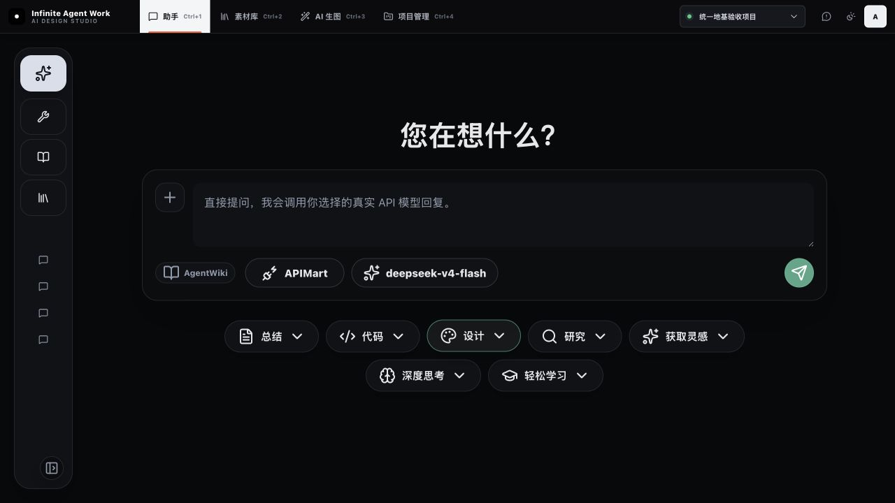

# 左侧抽屉保留判断

## 结论

当前左侧竖向图标栏作为“全局模块导航”已经没有保留必要，因为助手、素材库、AI 生图和项目管理已经完整出现在顶部导航中。

需要保留的是“模块内部抽屉”，而不是当前这组重复的全局入口。

## 当前证据

- 顶部已经提供四个一级入口及 `Ctrl+1–4`。
- 左侧再次放置 Agent、图像工具、资源库等图标，产生两套并行导航。
- 当前收起状态只显示图标，DOM 中除“展开菜单”外的按钮没有可读名称，存在可发现性和辅助技术识别风险。
- 左栏占用横向空间，但在助手首页没有提供足够的项目内信息。

## 推荐结构

| 模块 | 左侧区域应该显示什么 | 是否常驻 |
|---|---|---|
| 助手 | 新建对话、搜索、项目会话、历史记录 | 保留，可收起 |
| 素材库 | 永久库/项目库、项目、分类、筛选数量 | 保留 |
| AI 生图工具页 | 生图、编辑、增强、角度、智能画布等工具分类 | 保留 |
| 智能画布 | 不显示通用左栏；历史、图层、资源等按需抽屉 | 不常驻 |
| 项目管理 | 项目总览、任务、节点、会议等项目树 | 保留 |

## 应删除

- 左栏中重复的助手、图像工具、资源库等一级模块图标。
- 没有标签、仅靠图标猜测含义的会话按钮。
- 在没有实际抽屉内容时仍显示的底部收起/展开按钮。

## 下一版原则

顶部只负责“我在哪个工作域”；左侧只负责“这个工作域里面看什么”。同一入口不能同时出现在顶部和左侧。
