# 申江海工作室 AI App：外层 UI、页面、按钮与闭环功能地图

> 分析日期：2026-07-20  
> 分析对象：`申江海工作室AI介入设计工作分享_original_原文.docx`、93 分钟原始录屏、用户提供截图与逐帧抽取画面  
> 用途：为 Infinite Agent Work 的“统一地基 + 项目纵向闭环”提供可实施的产品设计参照

## 结论

可以学，而且非常适合当前项目。但最值得学习的不是“黑色顶栏 + 白色页面”这一层皮肤，而是下面四个系统级设计：

1. 一个固定的全局顶栏，把助手、素材库、AI 渲染、项目管理、工时五个工作域并列起来。
2. 一个持续存在的项目上下文，使不同工作域围绕同一个项目、同一批素材和同一条任务链协作。
3. 左侧模块导航、中间主工作面、右侧上下文助手的稳定三栏结构。
4. 从“生成 → 评价 → 入库 → 检索 → 再生成 → 反馈 → 技能沉淀”的纵向数据闭环。

Infinite Agent Work 已有助手、资源库、智能画布、项目工作台和资产血缘基础，不需要推倒重做。正确做法是先统一最外层 Shell，再把现有页面接入同一项目上下文。

## 证据与时间校准

- 视频：1920×1080、30fps、总长约 01:33:04。
- 转写稿时间比播放器时间约早 04:14。
- 本报告同时给出：
  - `T`：转写稿时间。
  - `V`：视频播放器时间，约等于 `T + 04:14`。
- 三张用户截图与视频位置校验一致。例如播放器 15:26 对应转写约 11:12。
- 清晰可见的文字或控件记为“直接观察”；由演示讲解确认但画面未完整展示的记为“转写确认”；无法确认的按钮不做猜测。

---

## Step 1 — 全局顶栏与应用框架

**状态：健康，信息架构清楚；小字号和无文字图标影响可发现性。**

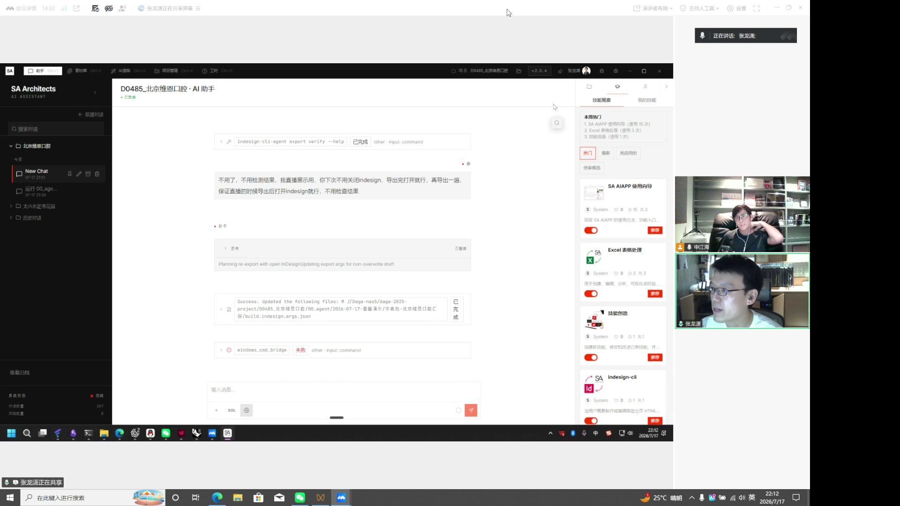

### 顶栏按钮与功能

| 控件 | 快捷键 | 功能 | 证据位置 |
|---|---:|---|---|
| 助手 | Ctrl+1 | 进入项目 AI 助手；处理对话、工具调用、桌面软件和项目任务 | T 10:01–10:51；V 14:15–15:05 |
| 素材库 | Ctrl+2 | 搜索、筛选、标注、收藏、管理项目素材 | T 10:51、34:40–38:40；V 15:05、38:54–42:54 |
| AI 渲染 | Ctrl+3 | 进入展廊、公共/个人画布和无限画布式生成工作区 | T 10:51、27:10–32:47；V 15:05、31:24–37:01 |
| 项目管理 | Ctrl+4 | 项目总览、人员、交付节点、任务和会议管理 | T 11:51–13:07、23:18；V 16:05–17:21、27:32 |
| 工时 | Ctrl+5 | 查看或登记人员工时；转写确认其存在，录屏未完整展开页面 | T 11:51–13:07；V 16:05–17:21 |
| 当前项目 | — | 固定显示项目代码/名称；让不同模块共享项目上下文 | 顶栏直接观察；T 11:51、23:18、01:13:53 |
| 项目文件夹 | — | 进入或定位当前项目相关文件/目录；图标可见，具体动作未完整演示 | 顶栏直接观察 |
| 版本号 v2.0.4 | — | 标识当前工作台版本 | 顶栏直接观察 |
| 用户头像/姓名 | — | 打开用户菜单、账户或密码设置 | T 01:09:40–01:10:33；V 01:13:54–01:14:47 |
| 反馈问题 | — | 一键打开问题反馈闭环 | T 01:05:43；V 01:09:57；画面可见“反馈问题”提示 |
| 设置/工具图标 | — | 进入设置或辅助功能；存在多个小图标，录屏未逐一演示 | 顶栏直接观察 |
| 最小化/最大化/关闭 | — | 桌面应用窗口控制 | 顶栏直接观察 |

### 值得借鉴

- 五个工作域始终在同一层级，用户不需要回到“首页”再找入口。
- 快捷键直接写在导航旁，适合高频生产型应用。
- 当前项目、版本、用户、反馈都处于同一全局层，便于建立“工作发生在哪个项目里”的心理模型。

### 风险

- 顶栏字号偏小，浅灰文字在黑色背景上的对比度有限。
- 多个无标签图标只能依赖悬停提示，新用户不容易发现。
- “素材库/AI 渲染/项目管理”是稳定模块，“反馈/设置/用户”是全局操作，两类控件视觉权重过于接近。

---

## Step 2 — 助手页

**状态：核心闭环强；聊天、技能和工具执行信息密度高。**


### 页面结构

- 左栏：新建对话、搜索对话、按项目组织的会话树、历史对话。
- 中栏：AI 对话、思考/工具执行卡、执行结果、输入框。
- 右栏：技能展廊与“我的技能”。

### 按钮与功能

| 区域 | 控件 | 功能 | 证据位置 |
|---|---|---|---|
| 左栏 | 新建对话 | 在当前项目中新建 AI 会话 | 画面直接观察；T 10:01 |
| 左栏 | 搜索对话 | 搜索项目内历史对话 | 画面直接观察 |
| 左栏 | 项目文件夹展开/收起 | 按项目、日期或主题组织会话 | 画面直接观察 |
| 左栏 | 对话项 | 恢复历史上下文 | 画面直接观察 |
| 左栏 | 对话项悬浮操作 | 可见固定/编辑/归档/删除类图标；具体顺序未逐项演示 | 画面直接观察 |
| 左栏 | 查看归档 | 查看已归档会话 | 画面直接观察 |
| 中栏 | 工具执行卡展开 | 查看命令、工具运行状态和结果 | T 10:01、画面直接观察 |
| 中栏 | 输入框 | 给助手自然语言任务 | T 10:01、24:07 |
| 中栏 | “+” | 附加资源或扩展输入；具体菜单未展开 | 画面直接观察 |
| 中栏 | 模型/模式选择 | 画面出现 `SQL`、`FLASH` 等模式标签；用于切换任务模式或模型 | 画面直接观察，具体语义未完整讲解 |
| 中栏 | 联网/地球图标 | 允许联网或外部检索 | 画面直接观察 |
| 中栏 | 发送/停止 | 提交任务；运行时可停止 | 画面直接观察 |
| 右栏 | 技能展廊 | 浏览团队共享技能 | T 10:51；V 15:05 |
| 右栏 | 我的技能 | 查看自己启用或创建的技能 | 画面直接观察 |
| 右栏 | 热门/最新/我启用的/待审核 | 对技能进行状态和排序筛选 | 画面直接观察 |
| 右栏 | 技能开关 | 启用/停用某个技能 | 画面直接观察 |
| 右栏 | 推荐 | 把技能推荐给团队成员 | T 10:51；V 15:05 |
| 右栏 | 技能卡 | 查看技能描述、作者、使用次数和评价 | 画面直接观察 |

### 功能语义

- 助手不是独立聊天机器人，而是整个应用的操作层。
- 它可以读取项目上下文、调用技能、检索资产，并控制 InDesign 等桌面软件。
- 技能可由实际失败案例沉淀，再进入团队技能展廊，形成可复用能力。

---

## Step 3 — 素材库

**状态：分类和检索能力强；侧栏过密，筛选层级偏多。**

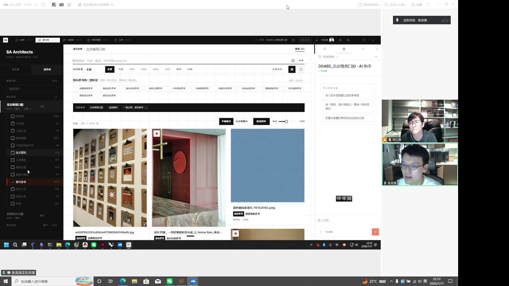

### 页面结构

- 左栏：永久库/项目库、项目搜索、项目树、素材分类和数量。
- 中栏：全局搜索、类型筛选、标签筛选、结果卡片。
- 右栏：上下文助手、建议问题、任务输入。

### 按钮与功能

| 区域 | 控件 | 功能 | 证据位置 |
|---|---|---|---|
| 左栏 | 永久库 / 项目库 | 在全局长期资产和当前项目资产之间切换 | 画面直接观察 |
| 左栏 | 搜索项目 | 在项目列表中定位素材所属项目 | 画面直接观察 |
| 左栏 | 项目条目 | 切换当前项目素材空间 | 画面直接观察 |
| 左栏 | 分类复选框 | 按效果图、分析图、汇报文本、模型截图、平面排版源文件、技术图纸、三维模型、模型贴图、数据与指标、意向参考、材料工艺、聊天记录、其他筛选 | 画面直接观察 |
| 中栏 | 搜索框 | 按路径、分类、描述、文件名、asset_id 搜索 | 画面直接观察；T 34:40–38:40 |
| 中栏 | 全部/位图/PDF/CAD/DOC/XLS/视频/其他 | 按文件类型过滤 | 画面直接观察 |
| 中栏 | 高级筛选/标签 | 组合项目、风格、空间、材质等条件 | 画面直接观察 |
| 中栏 | 筛选条件 Chip | 显示助手或用户产生的当前查询条件，并可移除 | T 34:40–38:40 |
| 中栏 | 清空条件 | 一次清除筛选 | 画面直接观察 |
| 中栏 | 平铺展示 | 以图片网格展示资产 | 画面直接观察 |
| 中栏 | 以分组展示 | 按项目、分类或标签聚合 | 画面直接观察 |
| 中栏 | 批量操作 | 对多张素材执行统一动作 | 画面直接观察 |
| 中栏 | 缩放滑杆 | 调整素材卡密度和缩略图大小 | 画面直接观察 |
| 素材卡 | 打开素材 | 查看大图、元数据和 AI 描述 | T 37:48；V 42:02 |
| 素材卡 | 收藏 | 记录人工偏好和高质量样本 | T 31:56–32:47；V 36:10–37:01 |
| 素材卡 | 标签/描述 | AI 自动生成图像描述和标签，支持后续搜索 | T 37:48；V 42:02 |
| 右栏 | 历史/会话 | 查看与当前素材检索相关的助手会话 | 画面直接观察 |
| 右栏 | 建议问题 | 一键发起“找参考图/整理素材”等任务 | 画面直接观察 |
| 右栏 | 输入框 | 用自然语言搜索素材 | T 34:40–36:15 |
| 右栏 | 运行状态 | 展示 `materials_query` 等工具调用和返回结果 | T 36:15；V 40:29 |

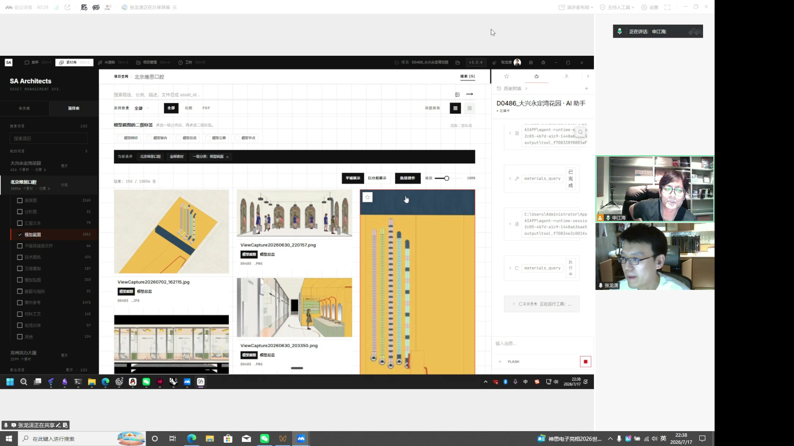

### 关键闭环

生成图片会自动进入素材库，AI 自动描述和打标签；用户收藏、点赞或选用的行为又成为质量信号。素材库因此不是一个文件夹，而是整个系统的“视觉记忆”。

---

## Step 4 — AI 渲染首页与无限画布

**状态：工作流完整，画布能力丰富；核心操作主要依赖图标和悬浮态。**

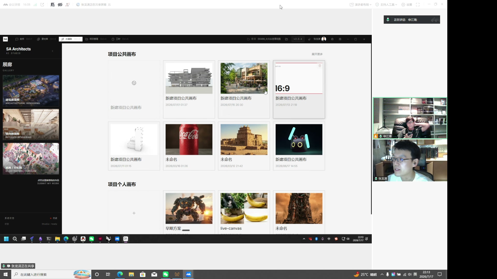

### AI 渲染首页

| 控件 | 功能 | 证据位置 |
|---|---|---|
| 建筑效果图 | 浏览建筑渲染案例/分类 | 画面直接观察 |
| 室内效果图 | 浏览室内渲染案例/分类 | 画面直接观察 |
| 插画/分析图 | 浏览插画、分析图案例/分类 | 画面直接观察 |
| SUBMIT MY WORK | 向团队展廊提交作品 | 画面直接观察；T 31:56–32:47 |
| 项目公共画布 | 进入团队共享项目画布 | T 27:10；V 31:24 |
| 项目个人画布 | 进入个人工作画布 | T 27:10；V 31:24 |
| 新建公共画布 | 在当前项目创建共享画布 | 画面直接观察 |
| 画布卡 | 打开既有画布 | 画面直接观察 |
| 展开更多 | 展开完整画布列表 | 画面直接观察 |

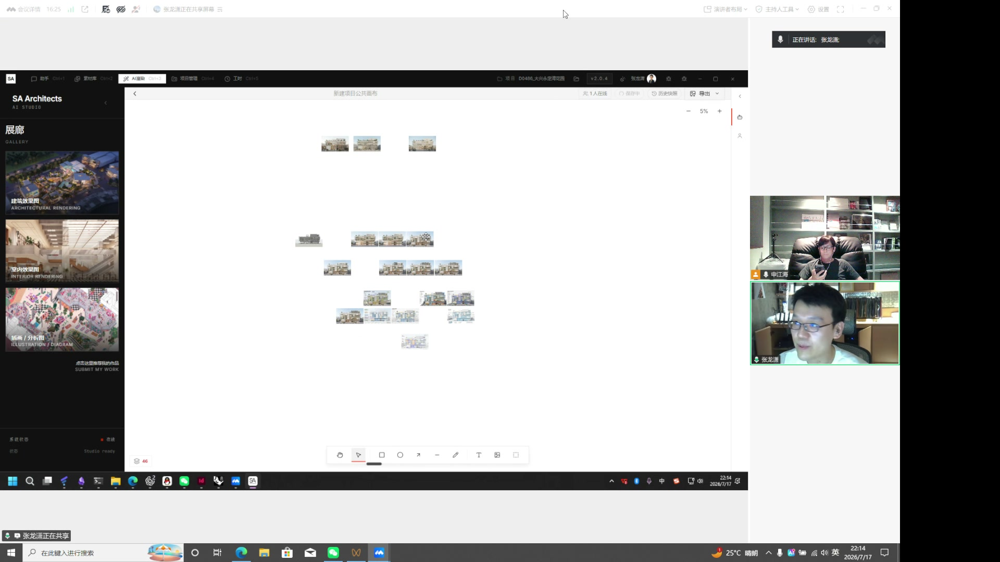

### 画布顶栏

| 控件 | 功能 | 证据位置 |
|---|---|---|
| 返回 | 回到 AI 渲染首页/画布列表 | 画面直接观察 |
| 画布标题 | 显示当前画布名 | 画面直接观察 |
| 在线人数 | 显示协作成员 | 画面直接观察 |
| 已保存状态 | 表示当前画布是否同步 | 画面直接观察 |
| 历史快照 | 查看或恢复画布历史 | 画面直接观察 |
| 导出 | 导出画布或内容 | 画面直接观察 |
| 缩放 - / 比例 / + | 调整无限画布视野 | 画面直接观察 |

### 画布底部工具

| 控件 | 功能 |
|---|---|
| 手型 | 拖动画布 |
| 选择 | 选择、移动、框选对象 |
| 矩形 | 新建矩形 |
| 圆形 | 新建圆形 |
| 箭头 | 建立方向关系或标注 |
| 直线 | 绘制连线 |
| 画笔 | 自由绘制 |
| 文本 | 新建文字 |
| 图片 | 上传/插入图片 |
| 框架/区域 | 创建画板或分组区域 |

### 图片选中后的悬浮工具

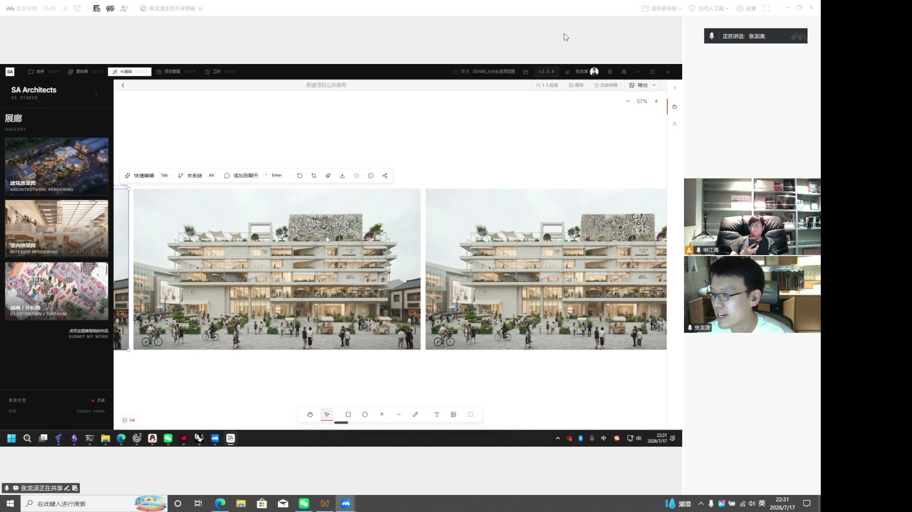

| 控件 | 快捷键 | 功能 | 证据位置 |
|---|---:|---|---|
| 快速编辑 | Tab | 对当前图像发起局部编辑 | 画面直接观察 |
| 关系链 | Alt | 显示原图、修改过程和派生结果的完整血缘 | T 29:35；V 33:49 |
| 添加到聊天 | Enter | 把选中图作为助手上下文 | 画面直接观察 |
| 旋转/撤销类图标 | — | 对图像进行基础变换；图标可见，录屏未逐项讲解 | 画面直接观察 |
| 裁剪 | — | 调整图片构图范围 | 画面直接观察 |
| 风格/画笔 | — | 进入风格或绘制编辑 | 画面直接观察 |
| 下载 | — | 下载选中图片 | 画面直接观察 |
| 收藏 | — | 加入喜欢/高质量样本 | T 31:56–32:47 |
| 信息 | — | 查看素材元数据 | 画面直接观察 |
| 分享 | — | 分享或提交图片 | 画面直接观察 |

---

## Step 5 — 项目管理与工时

**状态：总览清楚，但演示者明确说明项目上下文仍未完全自动同步。**

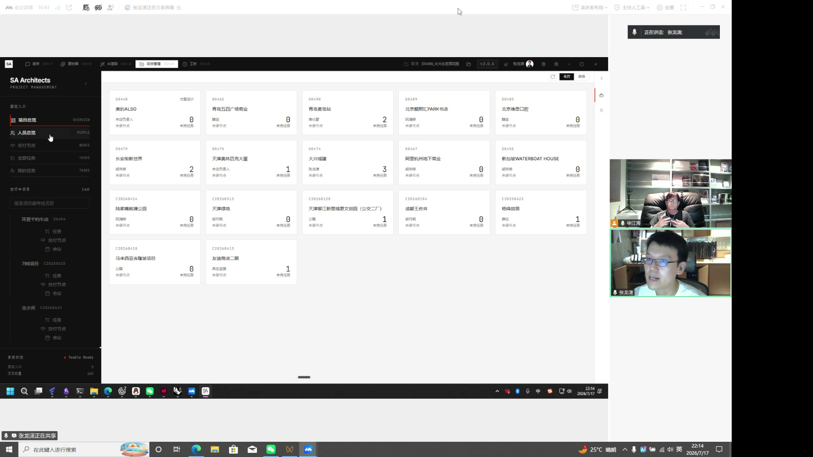

### 左侧管理入口

| 控件 | 功能 | 证据位置 |
|---|---|---|
| 项目总览 / OVERVIEW | 查看全部项目卡片和总体状态 | T 11:51–13:07 |
| 人员总览 / PEOPLE | 查看项目人员分布、参与情况 | T 11:51–13:07 |
| 交付节点 / NODES | 查看项目里程碑、交付节点和延期风险 | T 11:51–13:07 |
| 全部任务 / TASKS | 查看所有项目任务 | T 11:51–13:07 |
| 我的任务 / TASKS | 聚焦当前用户待办 | T 11:51–13:07 |
| 运行中项目 | 查看当前在执行的项目数量和列表 | 画面直接观察 |
| 搜索项目 | 定位项目 | 画面直接观察 |
| 项目树 | 展开项目下任务、交付节点、会议 | 画面直接观察 |

### 主区操作

| 控件 | 功能 |
|---|---|
| 项目卡片 | 显示项目代码、名称、项目经理、未完成节点和未完成任务；点击进入 |
| 卡片/表格切换 | 在视觉总览和高密度数据表之间切换 |
| 刷新 | 重新读取项目状态 |

### 当前真实性边界

- 演示中明确说明项目管理部分还没有完全完成上下文自动感知。
- 当前至少围绕 8 张核心表组织数据，已具备项目、人员、节点、任务、工时等基础。
- T 23:18、27:10 和 01:13:53 都说明“项目动态上下文”仍是继续建设的方向。
- 因此应学习它的结构，但不要把演示中的全部自动同步能力当成已上线事实。

### 工时页

顶栏存在“工时 Ctrl+5”，转写确认工时属于五视图之一。但录屏没有给出一个足够清晰、可逐按钮核对的完整工时页面。本报告不虚构其内部按钮。对我们而言，第一阶段只需保留入口和项目上下文；工时详情可在后续接现有任务/成员数据。

---

## Step 6 — 数据洞察与 AI 生产分析

**状态：指标与问题定位能力强；它目前像独立后台，视觉和主工作台不统一。**

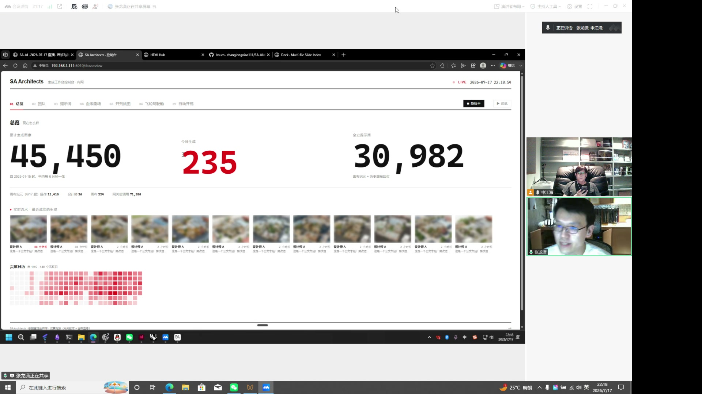

### 顶部分析标签

| 控件 | 功能 | 证据位置 |
|---|---|---|
| 01 总览 | 图片量、今日产出、提示词量、活动和日历热力图 | T 15:56；V 20:10 |
| 02 团队 | 按人/团队查看使用和产出 | T 15:56–17:09 |
| 03 提示词 | 分析一次命中率、迭代轮数、关键词和语义关系 | T 18:31–20:58 |
| 04 血缘现场 | 查看生成和编辑链路 | T 20:58–22:03 |
| 05 开荒进展 | 查看新任务/新能力探索状态 | 画面直接观察 |
| 06 飞轮驾驶舱 | 查看要求→提取→注入→裁剪→提示词→出图→评审链 | T 44:44；V 48:58 |
| 07 自动开荒 | 查看系统后台自动迭代、失败诊断和优化过程 | T 40:57–42:02 |
| 隐私/模糊 | 对敏感信息进行遮挡 | T 17:09；V 21:23 |
| 回放 | 回放一次生成或评审流程 | 画面直接观察 |

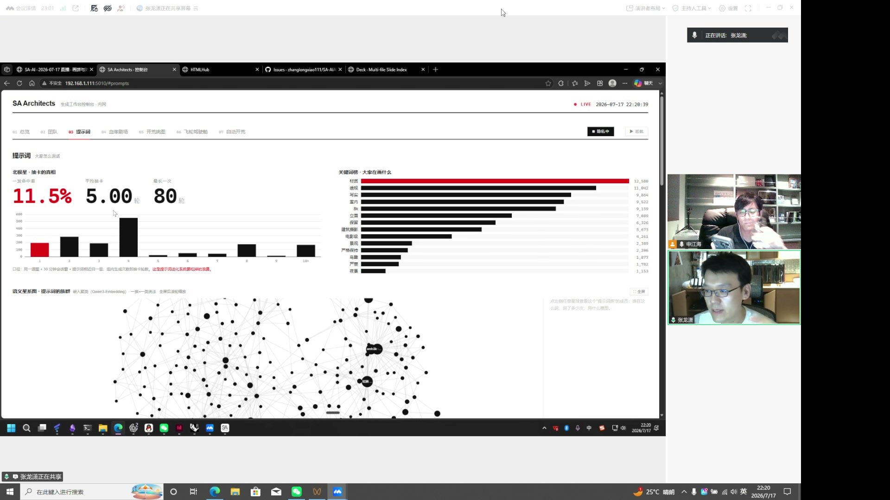

### 核心指标

- 图片累计约 45,450 张、提示词约 30,982 条（录屏当时数据）。
- 一次命中率 11.5%。
- 平均约 5 轮，极端案例最高 80 轮。
- 关键词频率和语义网络用来发现高频需求、失败模式和提示词相关性。

---

## Step 7 — 后台自动迭代与 AI 评审

**状态：这是产品最有价值的闭环之一；需要严格的可解释性和人工兜底。**

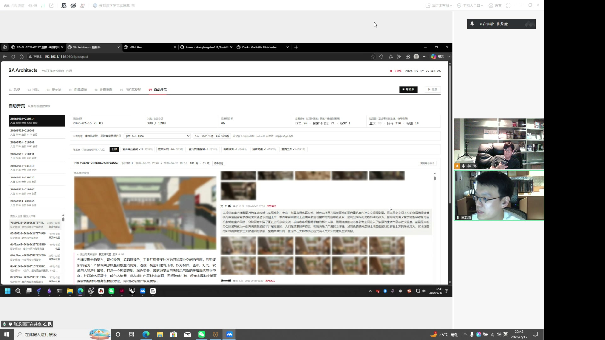

### 自动开荒页

| 控件/区域 | 功能 | 证据位置 |
|---|---|---|
| 运行列表 | 选择某一次后台迭代任务 | T 40:57；V 45:11 |
| 模型/角色/筛选 | 查看或限制当前迭代条件 | 画面直接观察 |
| 来源图 | 查看本轮起始样本 | 画面直接观察 |
| 迭代缩略图 | 逐轮查看输出 | 画面直接观察 |
| AI 诊断 | 分析提示词轨迹和失败原因 | T 42:02；V 46:16 |
| 技能沉淀 | 把稳定解决方式转为可复用技能 | T 42:02 |

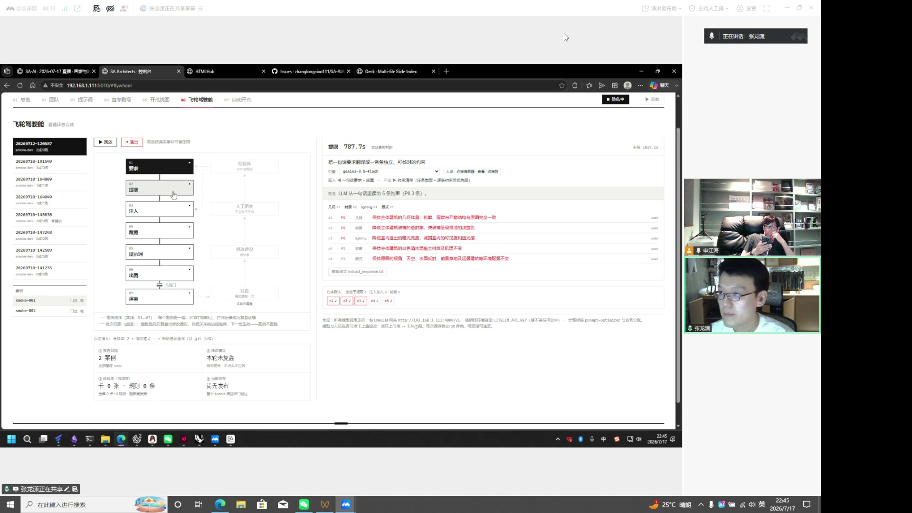

### 飞轮驾驶舱

| 阶段 | 功能 |
|---|---|
| 要求 | 收集用户/项目要求 |
| 提取 | 抽取可判断约束 |
| 注入 | 把约束注入上下文 |
| 裁剪 | 删除无关上下文，控制信息密度 |
| 提示词 | 生成执行提示 |
| 出图 | 批量产生候选 |
| 评审 | AI Judge 评分，不合格则拒绝并重试 |

T 44:44（V 48:58）明确说明：AI 评审对输出打分，批量任务中不合格结果会被拒绝或重试，结果再反哺技能。

---

## Step 8 — 参考板、排版与跨模块共享上下文

**状态：跨页面协作模型成熟；右侧上下文板值得直接借鉴。**

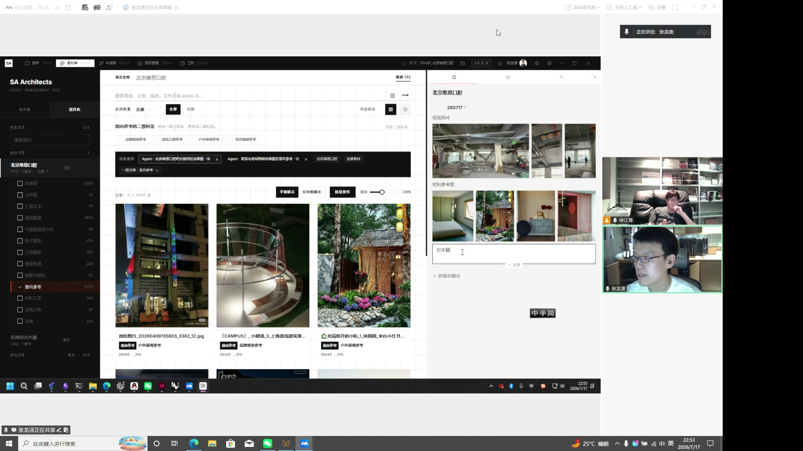

### 右侧参考板

| 控件 | 功能 | 证据位置 |
|---|---|---|
| 收藏夹标题/日期 | 标识当前参考板上下文 | T 49:43–50:14 |
| 图片缩略图 | 从素材库拖入现场照片、材料参考图等 | T 49:43–50:14 |
| 文本输入 | 为参考板添加说明 | 画面直接观察 |
| + 文字 | 新建文字便签 | 画面直接观察 |
| + 新建收藏夹 | 新建共享参考集合 | 画面直接观察 |

T 52:43（V 56:57）说明本地数据库还记录图片尺寸和比例，因此布局工具不需要重新识别即可排版。T 54:42（V 58:56）展示布局技能搜索项目资产并生成 HTML。

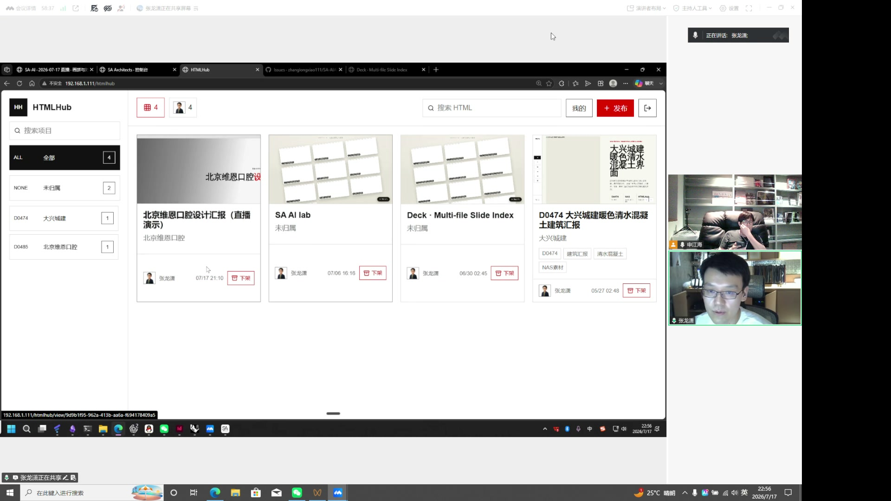

### HTMLHub 按钮

| 控件 | 功能 |
|---|---|
| 项目搜索/筛选 | 定位生成的 HTML 布局 |
| 资产/网格/用户标签 | 按不同维度查看内容 |
| 搜索 HTML | 按标题或内容搜索 |
| 我的 | 只看本人发布 |
| + 发布 | 发布新布局 |
| 下架 | 移除已发布内容 |
| 退出 | 离开 HTMLHub |

---

## Step 9 — 一键反馈与界面内帮助

**状态：闭环方向很好；入口过于隐蔽，反馈提交状态应更明确。**

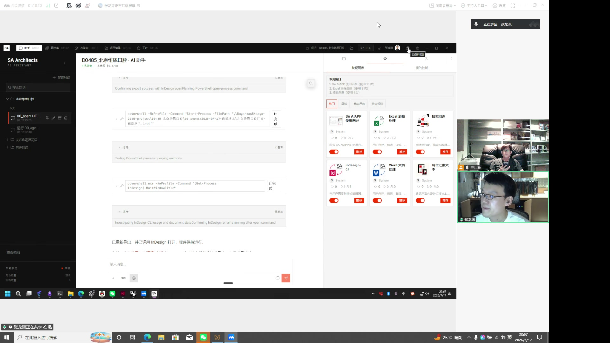

### 反馈闭环

1. 用户点击顶栏“反馈问题”。
2. 通过弹窗描述问题或建议。
3. 反馈形成可追踪的问题记录。
4. 助手/开发代理读取问题、修改并回报。
5. 修复结果继续进入下一轮产品迭代。

对应 T 01:05:43–01:08:09，V 01:09:57–01:12:23。视频序列能看到应用反馈入口、反馈弹层和外部问题页面，但弹层细小字段无法全部清晰识别，因此不虚构字段名称。

### 界面内帮助

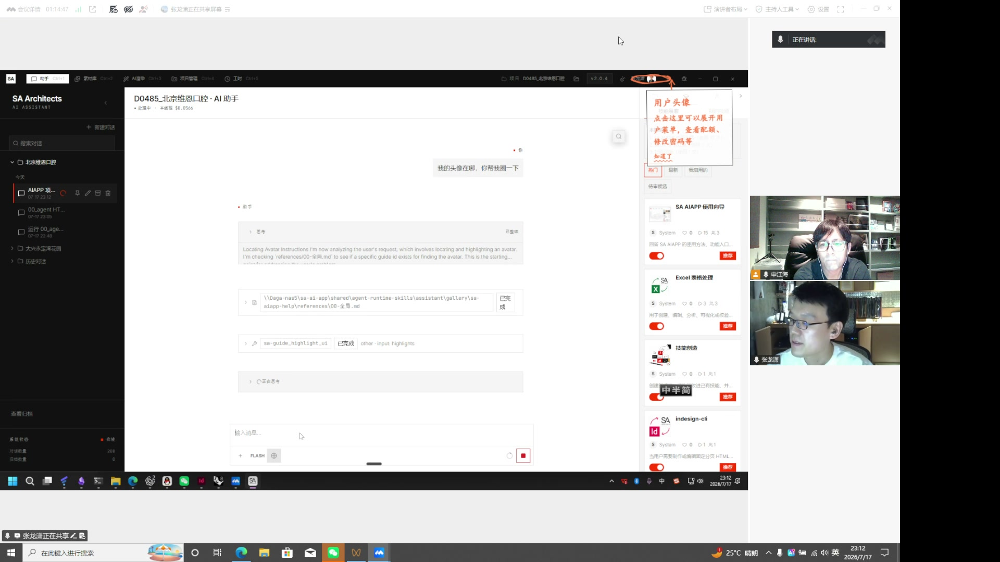

| 控件/动作 | 功能 | 证据位置 |
|---|---|---|
| 在助手中询问“某功能在哪” | AI 理解当前界面结构 | T 01:09:40–01:10:33 |
| 红色圈选与箭头 | AI 直接在页面上标注目标控件 | T 01:09:40–01:10:33 |
| 说明气泡 | 解释目标控件用途，如用户头像/用户菜单 | 画面直接观察 |
| 知道了 | 关闭视觉引导 | 画面直接观察 |

这比传统帮助中心更适合复杂生产工具：帮助内容发生在当前页面和当前任务里。

---

## Step 10 — 对 Infinite Agent Work 的落地映射

**状态：现有能力已覆盖约 70% 的地基；外层导航、项目上下文和视觉规范尚未统一。**

### 当前已有能力

| 现有页面/能力 | 对应申江海模块 | 当前可复用点 |
|---|---|---|
| `/static/index.html` | 助手 | Agent 对话、工具调用、知识库上下文 |
| `/static/library.html` | 素材库 | 图片/提示词库、来源管理、AI 标注、收藏、发送到智能画布 |
| `/static/smart-canvas.html` | AI 渲染/无限画布 | 画布编辑、资源库插入、结果回存 |
| `/static/project-workbench.html` | 项目管理 | 项目切换、项目画布、生成任务、项目资产、血缘 |
| 资产 lineage API | 关系链 | 上游、版本、下游分支 |
| 本地任务/API | 生产闭环 | 生成任务状态、结果数量、失败/取消状态 |

### 当前主要问题

1. `/static/index.html` 使用浅色主工作台壳，项目工作台使用紫蓝深色独立壳，智能画布又有自己的壳，视觉语言不统一。
2. “资源库、智能画布、项目工作台”之间主要靠页面内链接和跳转，不像参考 App 那样有固定顶栏。
3. `studio_active_project_id` 已存在，但它还没有成为每个模块明确可见、始终一致的项目上下文。
4. 项目工作台是独立页面，没有嵌入助手和右侧上下文 Dock。
5. 现有首页左栏是“图像工具/知识库/资源库”，与用户想要的“助手/素材库/AI 生图/项目管理/工时”不是同一层级。

### 建议的统一外层

```text
┌─────────────────────────────────────────────────────────────────────────┐
│ ∞  助手 Ctrl+1  素材库 Ctrl+2  AI生图 Ctrl+3  项目 Ctrl+4  工时 Ctrl+5 │
│                                      当前项目 ▾  搜索  反馈  设置  用户 │
├──────────────┬──────────────────────────────────────┬───────────────────┤
│ 模块左导航   │ 当前模块的主工作面                   │ 上下文 AI 助手    │
│ 项目/分类/树 │ 对话、素材网格、画布或项目看板       │ 当前选择/任务/技能│
├──────────────┴──────────────────────────────────────┴───────────────────┤
│ 状态：保存、同步、后台任务、错误与队列                                   │
└─────────────────────────────────────────────────────────────────────────┘
```

### 第一阶段应做的范围

1. 建立一个可复用 `StudioShell`：
   - 固定全局顶栏。
   - 五个一级入口。
   - 全局项目选择器。
   - 搜索、反馈、设置、用户。
2. 保留现有页面内部实现，先把四个已存在模块接入统一 Shell：
   - 助手。
   - 素材库。
   - AI 生图/智能画布。
   - 项目工作台。
3. 建立共享状态：
   - `activeProjectId`
   - 当前选中资产
   - 当前画布
   - 当前助手会话
4. 把右侧助手 Dock 做成跨页面通用组件：
   - 素材页：搜索/标注素材。
   - 画布页：解释和编辑选中图片。
   - 项目页：总结进度、生成任务。
5. 工时第一阶段只保留入口和空状态，不虚构未实现业务。

### 第二阶段再做

- 统一按钮、卡片、筛选器、空状态、加载态和错误态。
- 把素材收藏、画布采用、项目交付做成可统计的人类质量信号。
- 把生成结果自动入库、AI 标注、资产血缘和项目任务串成事件闭环。
- 增加“一键反馈”和“界面内视觉帮助”。

## 设计原则：学什么，不学什么

### 应直接借鉴

- 顶部五域切换和快捷键。
- 一个项目贯穿所有视图。
- 左导航 + 主工作面 + 右上下文助手。
- 黑色全局层、白色高密度工作层、红色主动作/状态强调。
- 画布选中对象后出现“关系链、添加到聊天、收藏”等跨模块动作。
- 自动入库、自动标注、人工偏好、AI Judge、技能沉淀组成的数据飞轮。

### 不应照抄

- 过小的文字和点击区域。
- 只靠图标、不提供常驻标签的关键操作。
- 过长、过密的素材分类侧栏。
- 主工作台与数据后台完全不同的视觉系统。
- 加载时大面积空白但没有明确骨架或进度。
- 把仍在建设中的“项目自动上下文”包装成已完成能力。

## 最终判断

申江海 App 的真正优势是：它把不同 AI 工具包进了一个项目制生产系统，并让每次生成、筛选、采用、失败和反馈都能继续产生数据。Infinite Agent Work 现在已经拥有助手、资源库、画布、项目工作台和资产血缘，最短路径不是再造功能，而是先统一外层 UI 与项目上下文，再完成“助手 → 画布 → 素材 → 项目 → 反馈”的纵向闭环。

