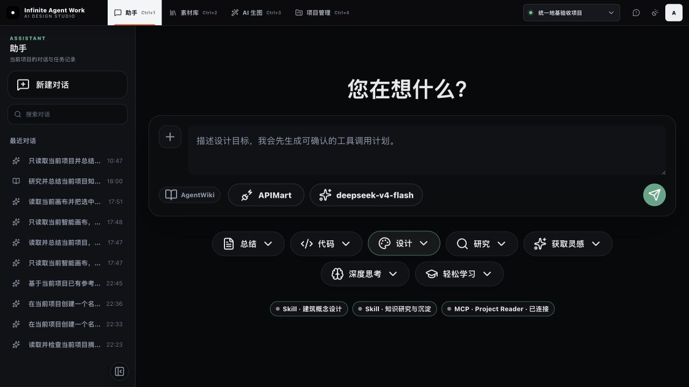
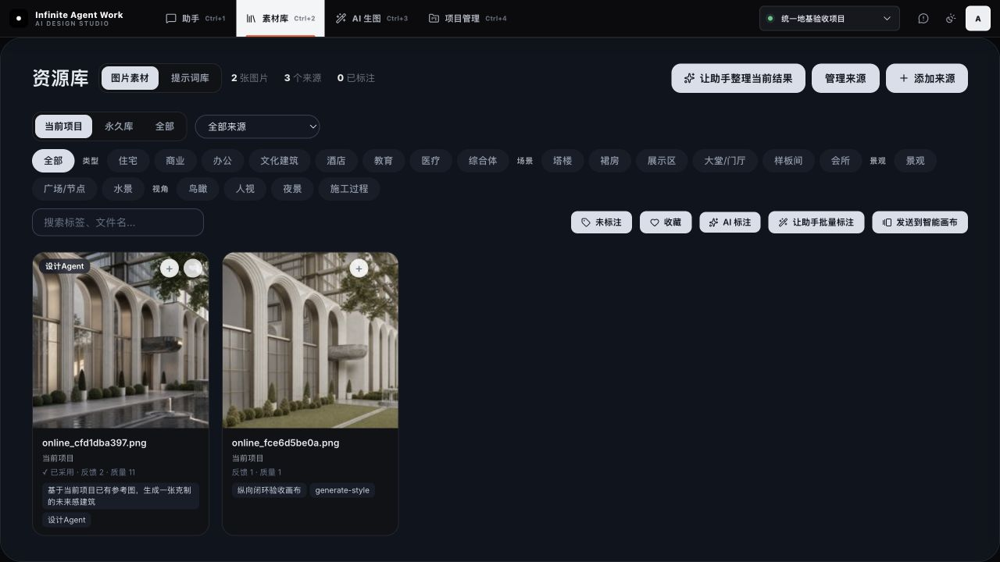
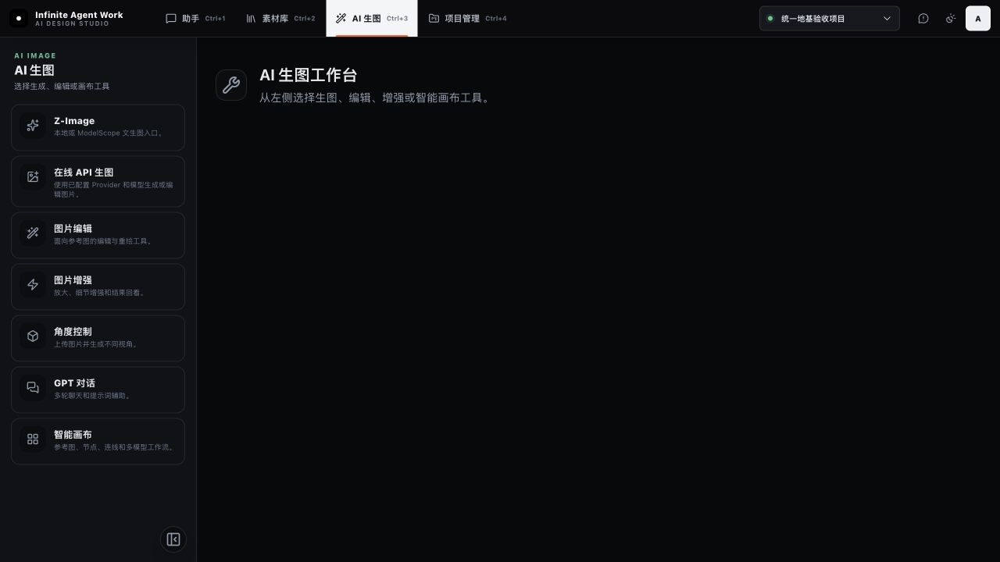
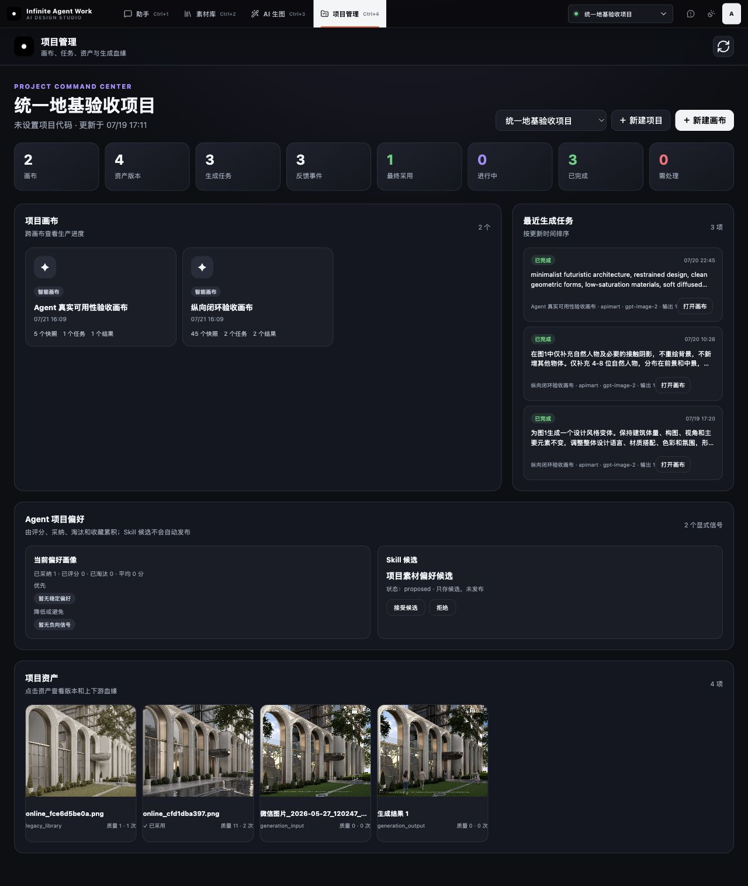
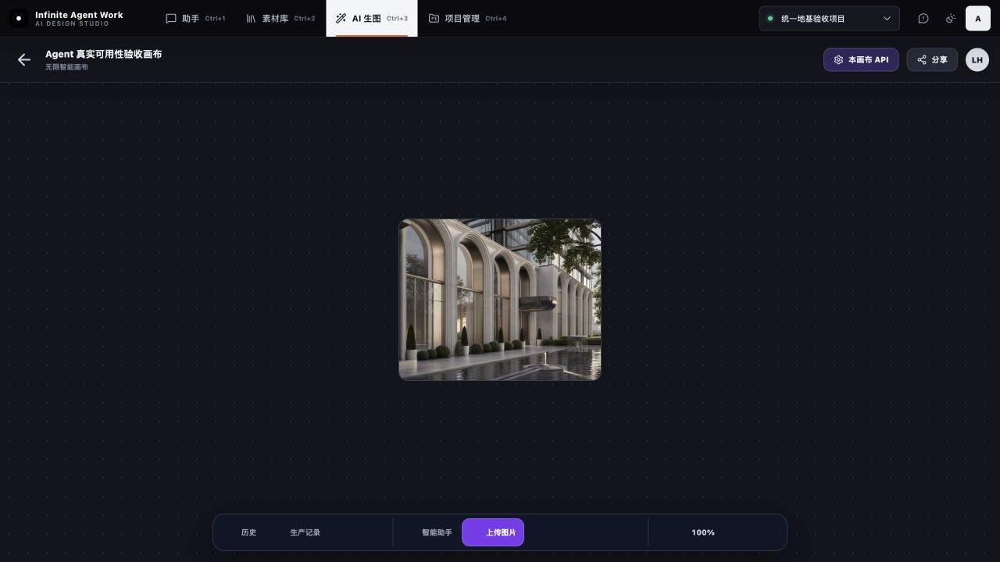

# 申江海逻辑与 Infinite Agent Work 学习路线

审计日期：2026-07-22

## 一句话结论

当前项目已经完成了“统一入口、真实 Agent 工具调用、项目归属、画布/素材/任务/血缘持久化”这层地基。下一阶段不应继续增加入口或照抄页面，而应建设申江海系统最有价值的部分：**把一次设计任务的要求、输出、评审、失败、重试、采用和技能候选接成可度量的自动学习闭环。**

## 审计范围与用户目标

- 参考材料：93 分钟分享转写稿、用户提供的录屏截图、已抽取关键帧。
- 当前产品：助手、素材库、AI 生图工作台、项目管理、智能画布。
- 用户目标：学习申江海系统的产品逻辑和组织学习方式，而不是只复刻视觉外壳。

## 申江海系统的真正逻辑

1. **所有动作先归属于项目。** 项目不是筛选器，而是素材、会话、画布、任务、模型调用和交付物共同的业务主键。
2. **所有结果都保留过程。** 不只保存最终图片，还保存源图、参考、Prompt、模型、参数、选择、淘汰和继续编辑关系。
3. **人类判断变成结构化信号。** 收藏、采用、推荐、继续编辑和最终进入交付物，比一句“不错”更有价值。
4. **失败轨迹被系统自动研究。** 长迭代链被识别后，Agent 提取问题和约束，生成改进方案，再由 AI Judge 按量表评审。
5. **评审不是终点，而是下一次执行的输入。** 不合格结果把失败原因回传给执行 Agent，自动改写并重试。
6. **稳定经验才能成为 Skill。** Skill 是经过真实轨迹、评审和复用验证的组织方法，不是两条偏好信号拼成的提示词。
7. **单点功能通过共享表示连接。** 参考板同时服务设计师沟通和 Agent 上下文；素材既出现在库里，也能进入画布、排版和交付。
8. **数据由组织持有。** 模型可以更换，但项目数据、轨迹、偏好、评审和技能留在本地系统。

## 当前项目现场审计

### Step 1 — 助手与统一项目入口：健康

优势：统一顶栏、持续可见的当前项目、项目内历史任务、计划后执行、Skill/MCP 状态已经成立。当前 Agent 不再只是文本聊天，而是能调用真实工具并留下任务记录。

风险：模式按钮仍像多个平行人格，用户不容易理解它们最终都由同一个 Kernel、项目上下文和权限系统执行；当前页也没有展示任务质量、评审结论和对项目能力的贡献。

### Step 2 — 素材库：基本健康

优势：项目库/永久库、分类、标签、收藏、标注、发送到画布已经进入统一壳，素材具备项目归属和后续使用入口。

风险：当前项目只有很少的可见样本，缺少“为什么被采用、在哪个任务中被采用、是否进入正式交付、被谁复用”的组织级语义；也没有共享展廊和同事推荐机制。

### Step 3 — AI 生图入口：偏弱

优势：生成、编辑、增强、角度控制、对话和画布工具被归到同一工作域。

风险：主区是空的，左侧仍像工具目录。它没有回答“当前项目正要完成什么设计任务、推荐用什么能力、最近结果如何、下一步该做什么”。这是当前最明显的导航层断点。

### Step 4 — 项目工作台与反馈：基本健康

优势：画布、资产版本、生成任务、反馈事件、最终采用、项目偏好和 Skill 候选都已持久化；刷新后仍可查，已经跨过“演示型 Agent”门槛。

风险：目前只有 2 个显式偏好信号，偏好画像尚不稳定，却已经出现 Skill 候选。缺少样本门槛、证据明细、版本、离线回放、评审指标和发布审核；项目上下文仍以数量统计为主，而不是动态的客户目标、场地、阶段、决策、风险和当前任务。

### Step 5 — 智能画布与结果血缘：健康但尚未形成评审闭环

优势：真实图片节点、历史、生产记录、助手、上传、资源库和画布级 API 都存在；结果可回存并保留血缘。

风险：画布主要表达“对象在哪里”，还没有在画布上表达任务要求、逐条约束、评审分数、失败原因、重试分支和最终采用状态。现有“重试”是人工动作，不是由质量门自动触发。

## 与申江海相比，当前真正缺少的能力

| 层级 | 当前状态 | 申江海的做法 | 判断 |
|---|---|---|---|
| 统一 Shell 与项目切换 | 已具备 | 五个工作域共用项目上下文 | 已学到 |
| 真实 Agent 与内部工具 | 已具备 | Agent 调技能、资产、桌面工具 | 地基已成 |
| 画布、素材、任务、血缘持久化 | 已具备 | 全过程留痕并可回放 | 核心链路已成 |
| 人工反馈进入偏好 | 初步具备 | 收藏、推荐、采用、复用形成正样本 | 需要扩大真实信号 |
| 动态项目上下文 | 很薄 | 客户、合同、现场、阶段、决策持续更新 | 关键缺口 |
| 结构化评审与自动重试 | 缺少 | 要求提取、AI Judge、失败回传、自动重试 | 最大缺口 |
| 生产分析 | 缺少 | 一次命中率、平均轮数、极端失败链、模型/提示词分析 | 最大缺口 |
| 组织共享展廊 | 缺少 | 推荐、点赞、作者、同事复用形成组织正样本 | 后续缺口 |
| Skill 治理 | 只有候选/人工接受 | 从大量失败轨迹中提炼并验证后共享 | 现在过早 |
| 专业交付桥接 | 缺少 | HTML 排版、InDesign 往返、桌面技能 | 应后置 |
| 3D/Rhino | 缺少 | 演示有价值但仍未跨过生产阈值 | 不应成为下一步 |

## 正确学习顺序

### 第一优先：质量门与可回放闭环

建立一个最小的 `Evaluation Run`：

1. 从用户目标、项目简报和参考图中提取 3–6 条可判断要求。
2. 每个生成任务保存要求快照、模型、参数、输入、输出和成本/耗时。
3. 一个或多个 Judge 对每条要求给出分数、通过/失败和修改理由。
4. 未过阈值时，把失败理由回传给执行 Agent；最多自动重试 2 次。
5. 人工采用、淘汰和评分可以覆盖 Judge，但必须保留两者差异。
6. 项目工作台显示一次命中率、平均迭代轮数、采用率和最常见失败原因。
7. Skill 候选至少满足真实样本数、跨任务复现和离线回放阈值后才允许进入审核。

验收标准：一条真实设计任务刷新页面后仍能看到“要求 → 第 1 次输出 → 逐项评分 → 失败原因 → 第 2 次输出 → 人工采用 → 入库 → 画布血缘”，并能统计它是否一次命中。

### 第二优先：项目参考板与动态上下文

- 新建项目级参考板，而不是另一种画布。
- 图片必须有角色：现场、材料、形态、氛围、禁止项、已确认方向。
- 文本必须有状态：事实、客户要求、设计假设、已确认决策、待核实问题。
- Agent 与团队读取同一份参考板，并在报告、生图、画布任务中记录引用。
- 项目上下文随任务和人工确认更新，不靠用户每次重新描述。

### 第三优先：组织共享与 Skill 治理

- 把“推荐到团队展廊”与“最终采用”分开。
- 记录作者、项目、任务类型、点赞、复用、进入交付和撤回。
- Skill 候选展示来源轨迹、适用范围、失败边界、版本和评审结果。
- 先在单项目灰度，再跨项目共享；禁止一键把个人偏好升级为组织规范。

### 第四优先：维护闭环和专业软件桥接

- 用户反馈附带当前页面、项目、任务 ID、日志和截图，形成可追踪问题。
- 修复后关联版本和验证结果。
- 只选一个高价值专业交付流程试点，例如 HTML 布局到 InDesign；不要同时铺开 Rhino、CAD、PPT 和所有桌面软件。

## 不应该照抄的部分

- 不做工时模块：它不影响当前设计数据闭环，且用户已明确不做。
- 不继续堆左侧工具入口：应让任务驱动工具，而不是让用户自己拼装流程。
- 不急着替换成 Pi/Hermes：它们可借鉴循环、工具协议、权限和恢复机制，但不会替你生成项目语义、评审量表和组织数据。
- 不以黑白视觉、顶部导航或页面数量衡量学习进度。
- 不把两三个素材反馈直接发布为 Skill。
- 不把人工“重试”误认为自动学习闭环。

## 最终建议

下一 Sprint 只做一件事：**Quality Gate + Replay（质量门 + 运行回放）**。它会把现有 Agent、素材、画布、任务、血缘和反馈第一次真正连成申江海所说的数据飞轮。完成后，再做参考板和动态项目上下文；视觉细节、共享展廊、InDesign/Rhino 都排在后面。

## 证据边界

- 申江海一侧的判断来自分享录屏、转写稿和关键帧，无法证明其未演示的异常恢复、权限和生产稳定性。
- 当前项目一侧已现场访问助手、素材库、AI 生图、项目管理和智能画布，并核对了持久化数据与代码入口；本次未执行新的生图任务，因此没有重新验证外部模型稳定性和耗时。
- 截图可以支持信息架构、状态呈现和主要流程判断，不能单独证明完整键盘可用性或 WCAG 合规。
