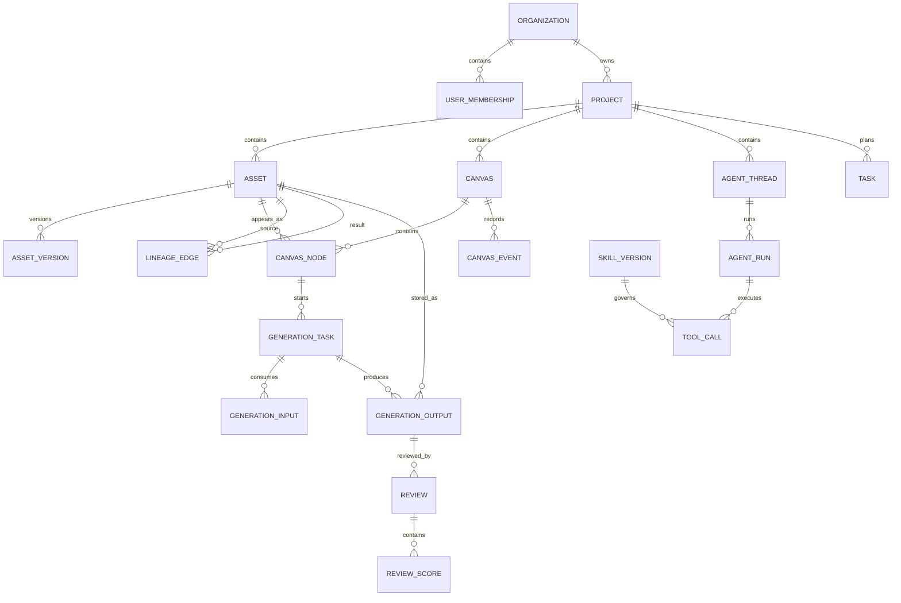

# 申江海工作室 AI 介入设计系统：UI、画布、工作流与技术架构复盘

> 视频：`申江海工作室AI介入设计工作分享_original.mp4`  
> 时长：约 1 小时 33 分；画面：1920×1080  
> 审阅方式：全片分段浏览、15 秒间隔抽帧、画布与 Agent/Rhino 段落按 3 秒加密抽帧、关键界面逐帧复核。  
> 证据边界：本报告重点复盘画面中能确认的产品与操作逻辑。视频没有现成字幕，本地也没有可用语音识别模型，因此演讲者口述但未出现在画面中的内容不作为确定事实。

## 一、结论先行

这套系统真正值得复制的，不是某一个 AI 生图按钮，而是四层能力被接成了一个闭环：

1. **统一项目上下文**：项目、素材、画布、对话、任务、工时都认识同一个项目。
2. **统一内容对象**：素材不是散落的文件，而是可检索、可引用、可生成、可追溯、可评价的对象。
3. **统一执行入口**：人既可以在画布中直接操作，也可以让 Agent 调用技能、桌面软件和自动化命令。
4. **统一数据回流**：每次检索、生成、选择、评价、排版和交付都继续沉淀为下次工作需要的上下文。

视频中的原话式页面总结是：“五个功能，一个数据底座”“散装 AI 是玩具，集成 AI 才是生产力”。这不是宣传语，而是它的产品架构：


它当前展示的五个顶层视图是：

- 助手：Agent 对话、技能调用、桌面软件协作；
- 素材库：项目素材、永久素材、标签、向量检索；
- AI 渲染：无限画布、参考图、生成、局部编辑、结果血缘；
- 项目管理：卡片墙、甘特、人员负载、月历；
- 工时：任务和时间记录。

我的核心判断是：**这不是“设计软件里接了几个模型”，而是一个面向建筑设计事务所的项目操作系统雏形。** 画布只是最显眼的工作界面；真正的壁垒是项目上下文、资产治理、操作血缘、Agent 技能和质量反馈。

---

## 二、报告中的证据等级

为避免把推测写成事实，后文使用三类标记：

- **已观察**：视频画面明确展示，能看到界面或状态变化。
- **合理推断**：由多个界面之间的数据一致性推断，技术实现未直接展示。
- **落地建议**：如果你要做同类产品，我建议采用的产品或技术方案，不代表视频系统已经这样实现。

---

## 三、视频内容时间线复盘

### 00:00–10:00：为什么要做统一系统

视频先建立问题背景：设计工作中的 AI 工具、项目文件、沟通、时间和桌面软件彼此割裂。随后给出统一工作台和五个入口。

**已观察**

- 顶层不是几十个工具入口，而是五个业务视图。
- “助手”深度集成 OpenCode；“素材库”展示约 257,000 条文本向量和三通道检索；“AI 渲染”累计生成 40,000+ 张；项目视图包含卡片墙、甘特、负载矩阵和月历。
- 系统强调“一体化”，而不是简单工具集合。

### 10:00–18:30：Agent、技能与运营数据


中央区域是 Agent 会话与执行过程；右侧是技能展廊/我的技能；左侧是会话和项目树。

**已观察**

- Agent 会显示工具调用、命令和成功/失败状态，不只输出一段文字。
- 技能以可管理卡片存在，可见 `Excel 表格处理`、`Word 文档处理`、`InDesign CLI`、`技能创造`、`制作汇报文本` 等。
- 会话按项目组织，说明聊天不是完全脱离业务数据的“全局聊天框”。
- 系统另有团队和模型运营面板，记录调用量、成功/失败、耗时和费用。


**合理推断**

- 每次模型请求至少记录：用户、项目、模型、状态、开始时间、结束时间、费用或 token、失败类型。
- 技能调用也存在结构化运行记录，否则无法稳定展示逐步执行和失败状态。
- 运营统计不是临时扫描日志生成，而应有事件表或日聚合表。

### 18:30–27:30：四个月建设结果与路线图


画面展示了过去规划的能力：素材库 RAG、数据飞轮、AI 助手、自动排版，以及仍未完成的材料对话、前期分析自动化等。

这里能看出建设顺序：先把**数据入口、项目资产和执行接口**打通，再去做更依赖专业知识的高阶 Agent。

### 27:30–35:30：AI 画布完整操作

这是本报告最重要的部分，后文单独深拆。全流程大致为：

1. 进入项目画布；
2. 浏览左侧共享展廊和画布已有内容；
3. 选中一个图像对象；
4. 通过对象悬浮工具栏进入快速编辑、关系链、加入聊天等操作；
5. 在贴近对象的 Prompt 区输入要求；
6. 选择模型、画幅、分辨率、质量、生成数量；
7. 生成多个结果；
8. 结果保留与源图的分支关系；
9. 查看单条结果的源图、局部区域、Prompt 和最终输出；
10. 将结果留在画布、加入素材，或推荐到共享展廊。

### 35:30–42:00：素材库与项目资产


**已观察**

- 素材按项目组织，也有永久素材库。
- 左侧是语义化分类，不只是文件夹：效果图、分析图、汇报文本、模型截图、平面图纸源文件、技术图纸、三维模型、贴图、数据与指标、信息表单、材料工艺、现场记录等。
- 卡片显示缩略图、文件名、标签、项目等元信息。
- 右侧 Agent 能在当前项目和当前资产上下文中工作。
- Agent 可切换模型并设置回答详细程度。

### 42:00–53:00：Agent 工作流、评审闭环与 Rhino


Agent 的一次任务不是单次 Prompt，而是具有步骤和验收门：

- 提示词；
- 出图；
- 几何门；
- 评审；
- 不满足时携带反馈重新运行。

评审页面使用明确的评价维度和分数，而不是“看起来不错”。可见需求符合、风格符合、画质等维度，并有接受结论。


Rhino 段落展示了模型从基础形体逐渐形成建筑、场景和图层结构。界面可见 Rhino 控制台、对象数量和 A01 等分层。

**合理推断**

- 浏览器 Agent 不会直接操作 Rhino 内部对象；中间应有桌面桥接层、插件、CLI 或本机服务。
- Agent 输出的应是结构化操作计划或脚本，桌面端执行后回传日志、对象数量、截图或文件。
- Rhino 操作必须有超时、取消、步骤日志、文件版本和回滚点，否则不适合生产使用。

### 53:00–64:00：InDesign 自动排版与同一数据底座


InDesign 段落展示自动化后的多页文档、版式、图片和材料信息。它的价值不是让大模型“画版式”，而是把项目结构、素材元数据和版式规则输入确定性排版程序。


画面明确列出五个功能贡献的数据：

1. 项目管理 → 项目结构与进度；
2. 画布 → 操作轨迹与画廊偏好；
3. 素材库 → 文本向量和退役图纸；
4. AI 助手 → 跨组件操作链；
5. InDesign 排版 → 排版规则和素材元数据。

### 64:00–78:00：上下文层级、尚未完成的能力与数据主权


视频把“欠的功能”解释为“欠上下文”：

1. APP 使用上下文：已经部署；
2. 组织上下文：已经在用；
3. 项目动态上下文：研究中；
4. 规范与物理红线：需要建设；
5. 材料供应链与造价：最深层。

这段很关键。材料对话、前期分析和规范审查难做，不是因为模型不会聊天，而是系统还缺少可信、动态、可定位的专业上下文。


### 78:00–93:04：飞轮、模型切换与本地数据


**已观察**

- 数据主权强调本地 NAS；
- 模型通过统一网关切换；
- 账户与支出由单一出口管控；
- 系统避免被某一个模型供应商绑定；
- 数据可以回环、飞轮和复用。

---

## 四、产品信息架构

### 4.1 顶层导航

顶层导航直接对应工作室日常的五种工作状态，而不是技术模块：

| 入口 | 用户心智 | 主要对象 | 主要动作 |
|---|---|---|---|
| 助手 | “让系统替我做事” | 会话、技能、运行、工具调用 | 提问、计划、执行、确认、复盘 |
| 素材库 | “找和管理项目内容” | 文件、图片、模型、图纸、标签、向量 | 上传、分类、检索、预览、引用 |
| AI 渲染 | “围绕图像探索方案” | 画布节点、参考图、Prompt、生成结果 | 摆放、生成、局部编辑、对比、分享 |
| 项目管理 | “现在做到哪、谁在做” | 项目、阶段、任务、成员、截止时间 | 排期、分工、查看负载、切换视图 |
| 工时 | “时间花在哪里” | 任务、时间段、人员 | 记录、归集、统计 |

这套结构的优点是：用户不需要知道 RAG、向量库、工作流引擎或消息队列。他只需要知道当前是在找素材、做方案、安排任务，还是让 Agent 执行。

### 4.2 项目是一级上下文

**合理推断**：项目 ID 应贯穿几乎所有核心数据。进入某项目后：

- 素材库默认过滤该项目；
- 画布保存于该项目；
- Agent 会话继承该项目的素材、成员、阶段和权限；
- 生成任务自动写入该项目；
- InDesign 导出读取该项目的结构化内容；
- 费用和使用量可以按项目归集。

如果你要做同类系统，绝不能先做五套页面，再用几个链接把它们连起来。应该先定义统一的 `project_id`、`asset_id`、`canvas_node_id`、`run_id` 和 `lineage_id`。

---

## 五、智能画布 UI 与操作逻辑深拆

### 5.1 画布总体布局


画面由五个区域组成：

1. **顶部全局栏**：项目/画布名称、在线协作、保存状态、历史、导出、设置；
2. **左侧展廊**：建筑效果图、室内效果图、插画/分析图等共享案例；
3. **中央无限画布**：图片、分析图、文本、线条、分组和生成结果；
4. **底部工具 Dock**：选择、手型、图形、箭头、线、画笔、文字、图片等；
5. **右上画布控制**：缩放、视口操作，必要时出现任务或属性配置。

它没有把全部功能永久塞进右侧栏。大多数能力只有在选中对象后才出现，因此视觉负担较低。

### 5.2 画布对象模型

从画面可判断，画布里至少存在这些对象：

- 图片对象；
- 文本对象；
- 矩形、椭圆等基础图形；
- 线、箭头、自由绘制；
- 分组或框架；
- AI 生成任务/结果对象；
- 参考图对象；
- 关系边或血缘边。

**落地建议**：不要把所有对象都存为一坨 Fabric/Konva JSON。应分两层：

- `scene_json`：为渲染和快速恢复保存的画布快照；
- 规范化节点表：保存对象身份、资产引用、生成任务、血缘和业务元数据。

否则后期很难回答：“这张图由哪张图、哪次局部选区、哪个模型、哪版 Prompt 产生？”

### 5.3 选择对象后的上下文工具栏


选中图片后，边框显示尺寸，悬浮工具栏贴近对象出现。画面中能辨认的主要操作包括：

- 快速编辑；
- 查看关系链；
- 添加到聊天；
- 撤销或重置类操作；
- 裁切/图像处理类操作；
- 下载；
- 收藏；
- 信息；
- 分享。

**交互原则**

- 工具栏属于对象，不属于整个画布；
- 高频操作靠近对象；
- 复杂参数在任务配置区展开；
- 当前对象同时成为 Agent 和生成任务的隐式上下文。

**需要注意的风险**

- 工具栏不能盖住对象关键内容；
- 画布缩放后要保持可读尺寸；
- 靠近屏幕边缘时应自动翻转到对象下方或侧面；
- 多选时必须切换为批量工具，不能继续显示单图工具。

### 5.4 Prompt、模型与参数

Prompt 输入框直接出现在源图下方，降低“我正在编辑哪张图”的歧义。参数界面可见：

- 模型：如 Nano Banana Pro、GPT Image 2；
- 画幅：自动、1:1、3:4、4:3、9:16、16:9、3:2、2:3、4:5、5:4、21:9；
- 分辨率：如 1K；
- 质量/细节；
- 生成数量：画面中为 4。

**落地建议**

- 模型选择应服从“画布级默认 + 单任务临时覆盖”，而不是每个按钮都重复放一套平台设置。
- 如果任务是编辑已有图片，默认应继承原图比例和方向；只有用户主动选择新画幅时才改变。
- 参数必须写入任务快照。模型配置后来发生变化，也不能改写历史任务的真实参数。

### 5.5 生成与结果布局


**已观察**

- 一次任务生成多个候选；
- 候选在源对象附近自动排列；
- 画布仍可继续操作，不是全屏阻塞；
- 结果与源图保留空间和逻辑关系；
- 新结果可以继续成为下一次任务的输入。

推荐的任务状态：

```text
draft
  → queued
  → dispatching
  → running
  → succeeded | partial_succeeded | failed | cancelled
```

每个候选输出也要有独立状态。四张中两张成功、两张失败时，不能把整个任务简单标成失败。

### 5.6 参考图选择


参考图不只来自本地上传。画面展示了共享展廊选择器：

- 网格展示图片；
- 每条内容带作者、标题/Prompt 摘要、喜欢数；
- 点击某项将其作为当前任务参考；
- 背景画布保持，关闭后继续原任务。

推荐的参考来源：

- 当前画布对象；
- 当前项目素材；
- 永久素材库；
- 共享展廊；
- 本地上传；
- 历史生成结果。

所有来源最终都应转换为统一的 `asset_ref`，避免每个来源拥有一套生成接口。

### 5.7 局部编辑与结果血缘


结果详情是这套画布最成熟的部分之一。页面不是只显示最终图，而是展示：

- 快速编辑的源图；
- 局部重绘的中间步骤；
- 虚线标出的选区；
- 每一步 Prompt；
- 最终结果；
- 参考图条；
- 收藏、加载到画布、取消推荐等动作。

这说明“血缘”至少需要记录：

```text
源资产
  └─ 编辑任务
      ├─ 选区/遮罩
      ├─ Prompt 版本
      ├─ 参考资产
      ├─ 模型参数快照
      └─ 输出资产
```

空间连线只是血缘的一种展示，不应成为唯一数据来源。用户删除画布连线，数据库中的生成关系仍然必须存在。

### 5.8 分享与共享展廊

生成结果可以被推荐到共享展廊。提交界面包含：

- 分类：建筑效果图、室内效果图、插画/分析图；
- 可选标题；
- 确认推荐。

这会自然产生偏好信号：

- 什么内容被分享；
- 什么内容被收藏；
- 什么内容被别人选为参考；
- 哪些 Prompt/模型组合最常产生被接受的结果。

这些信号比单纯的“点赞量”更有价值，特别是“被再次用于项目”。

### 5.9 协作、历史和导出

顶部能看到在线协作人数、保存状态、历史和导出入口。

**落地建议**

- 第一阶段可做单编辑者锁 + 其他人只读，避免过早实现完整 CRDT。
- 如果必须实时多人编辑，画布变更需要操作 ID、客户端 ID、逻辑时钟和幂等。
- 历史记录应由事件或版本快照生成，不能只依赖浏览器撤销栈。
- 导出至少区分：视口截图、选区导出、原始资产下载、整个画布 JSON/项目包。

### 5.10 画布核心状态机

建议明确以下 UI 状态，不要仅靠零散布尔值：

```text
CanvasMode
  idle
  panning
  selecting
  multi_selecting
  drawing
  editing_text
  editing_crop
  selecting_mask
  connecting
  presenting

SelectionState
  none
  single_node
  multi_node
  edge
  locked_node

TaskPanelState
  closed
  configure
  validating
  queued
  running
  showing_results
  retryable_error
```

高频 Bug 往往来自状态相互冲突，例如：正在画多边形选区时还能拖动源图、生成中切换对象导致 Prompt 丢失、工具栏遮挡对象、从参考选择器回来后任务重置。

---

## 六、各功能模块逐项复盘

### 6.1 AI 助手

**界面组成**

- 左：项目、对话和历史会话树；
- 中：用户消息、Agent 计划、工具调用、执行输出；
- 右：技能展廊、我的技能、技能开关和推荐。

**功能细节**

- 对话与项目绑定；
- 技能可发现、可开关、可版本化；
- 工具调用显示状态；
- 支持命令行、文件和桌面软件能力；
- 失败不是隐藏在一条泛化错误中，而是显示在执行链内。

**建议补足**

- 执行前计划与权限确认；
- 只读/写入/外发三类权限；
- 工具调用取消、重试和从失败步骤继续；
- 运行产物自动写回项目；
- 每一步保留输入、输出、耗时和日志；
- 涉及桌面软件时显示“本机正在执行”的明确状态。

### 6.2 素材库

**核心不是存储，而是资产语义化。**

每个资产至少要有：

- 所属组织、项目；
- 文件类型与业务分类；
- 原始文件、预览图、缩略图；
- 标题、描述、标签；
- 尺寸、比例、页数、格式；
- 来源、作者、版权/权限；
- OCR/文本提取；
- 向量；
- 使用和生成血缘；
- 当前版本与历史版本。

三通道检索很可能是：

1. 关键词/全文检索；
2. 向量语义检索；
3. 结构化元数据和标签过滤。

较稳妥的排序方式是混合召回后再排序，而不是只用向量相似度。

### 6.3 AI 渲染

应拆成统一任务内核上的不同模板，而不是每个功能各写一套后端：

- 文生图；
- 图生图；
- 快速编辑；
- 局部重绘；
- 风格参考；
- 多参考图；
- 放大/增强；
- 背景/人物/材料等专业任务。

统一任务内核负责：

- 模型路由；
- 参数校验；
- 上传和输入规范化；
- 队列；
- 进度；
- 重试；
- 成本；
- 输出入库；
- 血缘；
- 回写画布。

### 6.4 项目管理

视频主要显示能力清单，细节较少。可确认的视图包括：

- 卡片墙；
- 甘特；
- 人员负载矩阵；
- 月历。

**落地建议**

这些不是四套任务数据。统一任务表包含负责人、状态、开始/结束时间、估算工时、实际工时和依赖关系，不同页面只是不同投影。

### 6.5 工时

工时应与任务和项目关联，而不是独立打卡表。建议支持：

- 手动开始/停止；
- 补录；
- 从 Agent/画布操作建议归属任务，但由人确认；
- 按项目、阶段、任务、人员聚合；
- 不把“APP 开着”误认为有效工时。

### 6.6 Rhino / 桌面软件自动化

建议采用四段式：

```text
Agent 计划
  → 结构化命令/脚本
  → 本机桥接服务或软件插件执行
  → 日志、截图、文件版本和结果回传
```

关键安全边界：

- 白名单命令；
- 工作目录沙箱；
- 文件写入预览；
- 操作前保存版本；
- 可取消；
- 超时；
- 审计日志；
- 失败时保留现场。

### 6.7 InDesign 自动排版

推荐将 AI 与确定性排版分离：

- AI：提取内容、归类素材、生成文案草稿、推荐版式；
- 规则引擎：页面尺寸、网格、边距、字体、段落样式、图片适配；
- InDesign CLI/脚本：创建文档、放置链接、套用样式、导出 PDF；
- 验证器：缺图、溢出文本、低分辨率、链接失效、页数、导出结果。

这样输出才能重复、可修订、可审计。

### 6.8 评审与数据飞轮

评审需要结构化量表：

- 需求符合；
- 风格符合；
- 画质；
- 几何/物理合理性；
- 规范风险；
- 是否接受；
- 具体修改意见。

反馈应回到：

- 当前运行的重试上下文；
- Prompt 模板版本；
- 模型路由统计；
- 项目偏好；
- 组织级最佳实践；
- 可检索的成功/失败案例。

---

## 七、逐步流程与“流程健康度”

以下按真实任务链列出主要步骤。健康度是基于画面证据的产品审查，不代表代码质量。

1. **进入统一工作台并切换五个视图 — 健康**
   - 导航稳定、用户心智清晰；
   - 风险：项目上下文切换是否在所有视图同步，视频未展示异常场景。

2. **进入某项目并加载画布 — 健康**
   - 项目名、协作和保存状态可见；
   - 风险：大画布和大量高清图时的加载策略未展示。

3. **从画布选择源对象 — 健康**
   - 边框、尺寸和上下文工具栏反馈明确；
   - 风险：工具栏在边缘和小对象上可能遮挡。

4. **配置 Prompt、模型、比例、质量和数量 — 基本健康**
   - 参数集中，任务对象明确；
   - 风险：模型能力差异、费用估算、不可用参数组合未见解释。

5. **从共享展廊选择参考 — 基本健康**
   - 参考来源真实、可复用；
   - 风险：搜索、筛选、版权和跨项目权限未在画面体现。

6. **异步生成多个候选 — 健康**
   - 画布不中断，结果与源对象保持空间关系；
   - 风险：单张失败、取消、断网恢复和队列拥堵状态未展示。

7. **查看结果血缘和局部编辑步骤 — 很健康**
   - 来源、选区、Prompt 和结果同时可见；
   - 这是整个系统中最值得保留的交互。

8. **将结果加载到画布或推荐到共享展廊 — 健康**
   - 私人探索和组织共享之间有明确动作；
   - 风险：发布审核、版本替换、撤回和可见范围未见。

9. **从素材库检索项目资产并交给 Agent — 基本健康**
   - 项目资产与 AI 助手共屏；
   - 风险：批量操作、重复文件、版本冲突和权限提示未展示。

10. **Agent 调用技能并执行 — 基本健康**
    - 步骤和成功/失败可见；
    - 风险：批准边界、危险动作确认、敏感数据外发提示不足。

11. **进入几何门与结构化评审 — 很健康**
    - 把“生成完成”和“业务验收”区分开；
    - 风险：评分者、评分版本和判定阈值需要审计。

12. **Agent 操作 Rhino / InDesign — 有价值但高风险**
    - 演示证明闭环可行；
    - 生产环境必须加强版本、回滚、权限、取消和异常恢复。

13. **运营数据和成本复盘 — 健康**
    - 成功率、耗时、模型和成本可见；
    - 风险：指标口径、缓存命中和重试成本需统一定义。

---

## 八、建议的系统后端架构

### 8.1 第一阶段不要直接微服务化

建议使用“模块化单体 + 独立异步 Worker”：

```text
Web / Desktop Client
        │
API + WebSocket/SSE
        │
模块化业务后端
├─ 身份与组织
├─ 项目与任务
├─ 素材与检索
├─ 画布与版本
├─ Agent 与技能
├─ 模型网关
├─ 生成编排
├─ 评审与反馈
└─ 运营与计费
        │
PostgreSQL + pgvector
Redis / Queue
S3 兼容对象存储或 NAS
异步生成 Worker / 索引 Worker / 导出 Worker
桌面桥接服务
```

边界清晰后，再把高负载生成、检索或桌面桥接拆为独立服务。

### 8.2 主要后端模块

#### 身份、组织与权限

- 用户、组织、团队、成员；
- 项目成员和角色；
- 资产、画布、分享内容的可见性；
- API 平台凭证引用；
- 审计日志。

#### 项目上下文服务

- 项目基本信息；
- 阶段、任务、里程碑；
- 当前项目动态摘要；
- 项目成员；
- 项目对象索引；
- 为 Agent 组装上下文。

#### 素材服务

- 大文件分片上传；
- 原文件、预览、缩略图；
- OCR/文本提取；
- 图像描述；
- 标签与分类；
- 向量索引；
- 版本；
- 血缘；
- 权限和签名下载。

#### 画布服务

- 场景快照；
- 节点和边；
- 操作事件；
- 协作；
- 历史版本；
- 视口和分组；
- 将生成结果安全回写到指定位置。

#### 模型网关

- 统一供应商接口；
- 模型能力表；
- 动态路由；
- 限流、重试和熔断；
- 成本估算；
- 凭证隔离；
- 输入输出审计；
- 供应商任务 ID 映射。

#### 生成任务编排

- 输入资产规范化；
- Prompt 模板和参数快照；
- 队列；
- 回调/轮询；
- 进度事件；
- 失败分类；
- 输出下载和入库；
- 血缘；
- 画布定位。

#### Agent 与技能运行时

- 会话；
- 计划；
- 工具调用；
- 人工确认；
- 运行检查点；
- 技能版本；
- 结构化产物；
- 桌面桥接。

#### 检索与上下文组装

- 全文召回；
- 向量召回；
- 结构化过滤；
- 混合排序；
- 权限过滤；
- 引用和证据定位；
- 项目动态摘要。

#### 评审与数据飞轮

- Rubric 模板；
- 人工/模型评审；
- 结果接受与拒绝；
- 修改建议；
- 重新运行；
- 偏好信号；
- Prompt/模型效果统计。

### 8.3 异步任务与事件

建议事件名：

```text
asset.uploaded
asset.preview_ready
asset.text_extracted
asset.embedding_ready

canvas.node_created
canvas.node_updated
canvas.snapshot_created

generation.queued
generation.started
generation.progress
generation.output_ready
generation.failed

agent.run_planned
agent.approval_requested
agent.tool_started
agent.tool_finished
agent.run_completed

review.submitted
result.accepted
result.shared
result.reused
```

关键写操作使用事务 + outbox，防止“数据库写成功但消息没发出”。

---

## 九、建议的数据库结构

推荐 PostgreSQL 为主库，`pgvector` 存向量，文件本体放 NAS 或 S3 兼容存储。数据库只保存对象元数据和存储键，不保存大二进制文件。

### 9.1 身份与组织

#### `organizations`

- `id`
- `name`
- `slug`
- `settings_json`
- `created_at`

#### `users`

- `id`
- `email`
- `display_name`
- `avatar_asset_id`
- `status`
- `created_at`

#### `organization_members`

- `organization_id`
- `user_id`
- `role`
- `joined_at`

唯一索引：`(organization_id, user_id)`。

### 9.2 项目、阶段、任务与工时

#### `projects`

- `id`
- `organization_id`
- `name`
- `code`
- `description`
- `status`
- `owner_user_id`
- `start_date`
- `target_date`
- `created_at`
- `updated_at`

#### `project_members`

- `project_id`
- `user_id`
- `role`
- `permission_json`

#### `project_phases`

- `id`
- `project_id`
- `name`
- `sequence`
- `status`
- `start_date`
- `end_date`

#### `tasks`

- `id`
- `project_id`
- `phase_id`
- `parent_task_id`
- `title`
- `status`
- `priority`
- `assignee_user_id`
- `start_at`
- `due_at`
- `estimated_minutes`
- `sort_key`
- `metadata_json`

#### `task_dependencies`

- `predecessor_task_id`
- `successor_task_id`
- `dependency_type`

#### `time_entries`

- `id`
- `project_id`
- `task_id`
- `user_id`
- `started_at`
- `ended_at`
- `duration_minutes`
- `source`
- `note`

### 9.3 文件与素材

#### `blob_objects`

- `id`
- `storage_provider`
- `storage_key`
- `sha256`
- `byte_size`
- `mime_type`
- `encryption_key_ref`
- `created_at`

`sha256` 可用于秒传和重复检测，但是否合并需要考虑权限边界。

#### `assets`

- `id`
- `organization_id`
- `project_id`，永久库资产可为空
- `owner_user_id`
- `asset_type`
- `business_category`
- `title`
- `description`
- `current_version_id`
- `visibility`
- `source_type`
- `status`
- `created_at`
- `updated_at`
- `deleted_at`

#### `asset_versions`

- `id`
- `asset_id`
- `version_number`
- `blob_object_id`
- `preview_blob_id`
- `thumbnail_blob_id`
- `width`
- `height`
- `duration_ms`
- `page_count`
- `metadata_json`
- `created_by`
- `created_at`

#### `tags`

- `id`
- `organization_id`
- `name`
- `color`
- `category`

#### `asset_tags`

- `asset_id`
- `tag_id`
- `source`：人工、模型、规则
- `confidence`

#### `asset_text_chunks`

- `id`
- `asset_version_id`
- `chunk_index`
- `text`
- `page_or_region_json`
- `token_count`

#### `asset_embeddings`

- `id`
- `asset_id`
- `chunk_id`
- `embedding_model`
- `embedding`
- `content_hash`

主要索引：

- `assets(project_id, business_category, created_at)`
- `asset_tags(tag_id, asset_id)`
- 全文 `GIN`；
- 向量 `HNSW` 或 `IVFFlat`；
- `blob_objects(sha256)`。

### 9.4 画布与协作

#### `canvases`

- `id`
- `project_id`
- `name`
- `current_snapshot_id`
- `created_by`
- `created_at`
- `updated_at`

#### `canvas_snapshots`

- `id`
- `canvas_id`
- `version_number`
- `scene_json`
- `thumbnail_blob_id`
- `created_by`
- `created_at`

#### `canvas_nodes`

- `id`
- `canvas_id`
- `node_type`
- `asset_id`
- `generation_output_id`
- `parent_group_id`
- `x`
- `y`
- `width`
- `height`
- `rotation`
- `z_index`
- `locked`
- `style_json`
- `data_json`
- `created_at`
- `updated_at`

#### `canvas_edges`

- `id`
- `canvas_id`
- `source_node_id`
- `target_node_id`
- `edge_type`
- `visible`
- `style_json`

#### `canvas_events`

- `id`
- `canvas_id`
- `actor_user_id`
- `client_id`
- `operation_id`
- `event_type`
- `payload_json`
- `base_version`
- `created_at`

唯一索引：`(canvas_id, operation_id)`，保证断线重试幂等。

### 9.5 模型、API 与画布级选择

#### `ai_providers`

- `id`
- `organization_id`
- `name`
- `provider_type`
- `base_url`
- `status`
- `capability_json`

#### `provider_credentials`

- `id`
- `provider_id`
- `secret_ref`
- `owner_scope`
- `last_verified_at`
- `status`

不要把 API Key 明文存数据库；保存到系统密钥库，数据库仅存引用。

#### `ai_models`

- `id`
- `provider_id`
- `external_model_id`
- `display_name`
- `capabilities_json`
- `parameter_schema_json`
- `pricing_json`
- `enabled`
- `sort_order`

#### `canvas_model_policies`

- `canvas_id`
- `task_type`
- `provider_id`
- `model_id`
- `default_parameters_json`
- `updated_by`
- `updated_at`

这张表支持“整张画布的生图都走当前选择 API，并可随时切换”；任务提交时再把配置复制进任务快照。

### 9.6 Prompt、生成任务与血缘

#### `prompt_templates`

- `id`
- `organization_id`
- `name`
- `task_type`
- `current_version_id`

#### `prompt_template_versions`

- `id`
- `template_id`
- `version_number`
- `system_prompt`
- `user_prompt_template`
- `parameter_schema_json`
- `created_by`
- `created_at`

#### `generation_tasks`

- `id`
- `organization_id`
- `project_id`
- `canvas_id`
- `source_node_id`
- `task_type`
- `provider_id`
- `model_id`
- `provider_task_id`
- `prompt_text`
- `negative_prompt`
- `parameters_json`
- `status`
- `requested_count`
- `success_count`
- `progress`
- `error_code`
- `error_message`
- `estimated_cost`
- `actual_cost`
- `queued_at`
- `started_at`
- `finished_at`
- `created_by`

#### `generation_inputs`

- `id`
- `generation_task_id`
- `asset_id`
- `input_role`：source/reference/mask/control
- `sequence`
- `region_json`
- `weight`

#### `generation_outputs`

- `id`
- `generation_task_id`
- `asset_id`
- `output_index`
- `status`
- `seed`
- `provider_metadata_json`
- `created_at`

#### `lineage_edges`

- `id`
- `from_asset_id`
- `to_asset_id`
- `relation_type`
- `generation_task_id`
- `metadata_json`

索引重点：

- `generation_tasks(canvas_id, created_at)`
- `generation_tasks(status, queued_at)`
- `generation_tasks(provider_id, model_id, created_at)`
- `lineage_edges(from_asset_id)`
- `lineage_edges(to_asset_id)`。

### 9.7 Agent、技能和工具调用

#### `agent_threads`

- `id`
- `project_id`
- `title`
- `created_by`
- `created_at`

#### `agent_messages`

- `id`
- `thread_id`
- `role`
- `content_json`
- `asset_refs_json`
- `created_at`

#### `agent_runs`

- `id`
- `thread_id`
- `project_id`
- `status`
- `plan_json`
- `context_snapshot_json`
- `started_at`
- `finished_at`
- `error_json`

#### `skills`

- `id`
- `organization_id`
- `name`
- `description`
- `current_version_id`
- `enabled`
- `permission_manifest_json`

#### `skill_versions`

- `id`
- `skill_id`
- `version`
- `definition_json`
- `content_hash`
- `created_at`

#### `tool_calls`

- `id`
- `agent_run_id`
- `parent_tool_call_id`
- `skill_version_id`
- `tool_name`
- `input_json`
- `output_json`
- `status`
- `approval_status`
- `started_at`
- `finished_at`
- `error_json`

### 9.8 评审、偏好和飞轮

#### `review_templates`

- `id`
- `organization_id`
- `name`
- `task_type`
- `version`

#### `review_criteria`

- `id`
- `template_id`
- `code`
- `name`
- `description`
- `weight`
- `scoring_schema_json`

#### `reviews`

- `id`
- `project_id`
- `generation_output_id`
- `reviewer_user_id`
- `reviewer_type`
- `template_id`
- `decision`
- `summary`
- `created_at`

#### `review_scores`

- `review_id`
- `criterion_id`
- `score`
- `passed`
- `comment`
- `evidence_json`

#### `preference_events`

- `id`
- `organization_id`
- `project_id`
- `user_id`
- `asset_id`
- `event_type`：view/favorite/select_as_reference/load_to_canvas/share/accept/reject
- `context_json`
- `created_at`

### 9.9 运营、成本和审计

#### `model_usage_ledger`

- `id`
- `organization_id`
- `project_id`
- `user_id`
- `provider_id`
- `model_id`
- `source_type`
- `source_id`
- `input_units`
- `output_units`
- `duration_ms`
- `cost`
- `status`
- `created_at`

#### `daily_usage_aggregates`

- `date`
- `organization_id`
- `project_id`
- `user_id`
- `model_id`
- `request_count`
- `success_count`
- `failure_count`
- `duration_p50`
- `duration_p95`
- `cost`

#### `audit_logs`

- `id`
- `organization_id`
- `actor_user_id`
- `action`
- `resource_type`
- `resource_id`
- `before_json`
- `after_json`
- `ip`
- `created_at`

---

## 十、核心实体关系



---

## 十一、关键 API 设计建议

### 项目与上下文

```text
GET    /api/projects/:id/context
GET    /api/projects/:id/activity
GET    /api/projects/:id/members
```

`context` 不应返回所有项目文件，而应返回轻量摘要、阶段、权限、常用素材和可供 Agent 检索的范围。

### 素材

```text
POST   /api/assets/uploads
POST   /api/assets/uploads/:id/complete
GET    /api/assets/search
GET    /api/assets/:id
POST   /api/assets/:id/tags
GET    /api/assets/:id/lineage
```

### 画布

```text
GET    /api/canvases/:id
POST   /api/canvases/:id/events
POST   /api/canvases/:id/snapshots
GET    /api/canvases/:id/history
PATCH  /api/canvases/:id/model-policy
```

### 生图

```text
POST   /api/generation-tasks
GET    /api/generation-tasks/:id
POST   /api/generation-tasks/:id/cancel
POST   /api/generation-tasks/:id/retry
GET    /api/generation-tasks/:id/outputs
```

前端通过 WebSocket/SSE 订阅进度，不要每个候选图都高频轮询。

### Agent

```text
POST   /api/agent/threads
POST   /api/agent/threads/:id/messages
POST   /api/agent/runs/:id/approve
POST   /api/agent/runs/:id/cancel
GET    /api/agent/runs/:id/events
```

---

## 十二、真正的数据飞轮如何形成

不是“把聊天记录全部塞进向量库”。更可靠的飞轮是：

1. 用户从素材库选择了什么；
2. 哪张图被放到画布；
3. 哪张图被用作参考；
4. 对源图做了什么操作；
5. 使用哪个模型和参数；
6. 四个结果里保留了哪个；
7. 哪个结果继续被编辑；
8. 哪个结果被评审接受；
9. 哪个结果被推荐到共享展廊；
10. 哪个案例后来又被同事复用；
11. 输出最后是否进入 InDesign 或正式交付物。

这些是比自然语言评价更强的隐式行为信号。建议把它们存在 `preference_events`，再按项目、团队和任务类型聚合。

**不要直接训练个人数据。** 第一阶段先用这些信号做：

- 检索排序；
- 案例推荐；
- 默认模型路由；
- Prompt 模板推荐；
- 参考图推荐；
- 失败预警；
- 项目上下文摘要。

---

## 十三、安全、权限与本地优先

视频强调本地 NAS 和单一模型出口，这对设计公司非常合理。

### 必须具备的安全控制

- API Key 进入系统密钥库，不写前端、不明文入库；
- 模型网关按组织、项目和用户记录调用；
- 资产下载使用短时签名 URL；
- 敏感项目可以限制特定外部模型；
- Agent 工具分只读、写入、外发、删除四级权限；
- 桌面操作需白名单和明确工作目录；
- 所有导出、分享、删除和外发记录审计；
- 软删除 + 保留期；
- 项目离职/成员移除后即时撤权；
- 备份数据库和对象存储，定期演练恢复。

### 本地 NAS 的现实问题

- NAS 不是数据库；
- 文件名和文件夹不能替代资产表；
- 多节点任务不要直接依赖不稳定的 SMB 路径；
- 建议由对象存储层或统一文件服务封装 NAS；
- 对外部模型上传时创建临时副本和到期删除策略。

---

## 十四、如果你要做一套，建议的建设顺序

### 第 0 阶段：统一身份和项目

- 组织、成员、项目、权限；
- 文件上传和对象存储；
- 模型网关；
- 统一操作日志。

**验收**：同一个项目 ID 能贯穿素材、画布和模型调用。

### 第 1 阶段：可用的画布生产闭环

- 图片/文本/基础图形；
- 对象选择、移动、缩放、分组；
- 项目素材拖入画布；
- 画布级 API/模型；
- 文生图、图生图、局部编辑；
- 比例、分辨率、数量；
- 异步任务、取消、重试；
- 多结果；
- 结果入资产库；
- 血缘详情；
- 历史和导出。

**验收**：从项目素材开始，生成、挑选、二次编辑、回存素材和追溯来源能完整走通。

### 第 2 阶段：素材检索和团队共享

- 业务分类、标签、OCR、图像描述；
- 全文 + 向量 + 元数据三通道检索；
- 项目库和永久库；
- 共享展廊；
- 收藏、参考、采用等偏好信号。

### 第 3 阶段：Agent 与技能

- 项目内会话；
- 计划、确认、执行；
- 只读工具先行；
- 生成、检索、汇总等内部技能；
- 运行日志、取消、重试和产物回写。

### 第 4 阶段：评审与桌面自动化

- 结构化 Rubric；
- 几何门和质量门；
- Rhino/InDesign 桥接；
- 版本、回滚和导出验证；
- 运营、耗时和成本面板。

### 第 5 阶段：专业上下文

- 项目动态上下文；
- 规范知识库；
- 材料与供应商；
- 造价；
- 前期分析。

这部分应该最后做，因为错误成本最高，也最依赖干净的底层数据。

---

## 十五、最值得借鉴的设计决定

1. **五个视图共用项目上下文，而不是五套独立产品。**
2. **生成结果是画布对象，也是项目资产。**
3. **血缘可视化到源图、选区、Prompt 和输出。**
4. **Agent 展示执行过程和失败，不伪装成无所不能。**
5. **评审是任务流程的一部分，不是生成后的随口评价。**
6. **桌面软件自动化通过技能/桥接接入，不强行重写 Rhino 和 InDesign。**
7. **共享展廊既是内容入口，也是组织偏好数据入口。**
8. **统一模型网关使模型可以更换，业务数据不被供应商绑架。**
9. **本地资产和组织知识被当作长期资产，而不是临时 Prompt 附件。**

---

## 十六、不要盲目照抄的部分

1. **不要一开始就做所有桌面软件。** 先打通一个可回滚、可验证的桥接流程。
2. **不要把画布连线等同于数据血缘。** 连线可以隐藏或删除，血缘必须独立持久化。
3. **不要只保存最终图片。** 源图、遮罩、参考、Prompt、模型和参数都要存快照。
4. **不要把向量库当知识库。** 权限、版本、出处、有效期和证据定位同样重要。
5. **不要让 Agent 自动执行所有写操作。** 专业设计文件的错误代价很高。
6. **不要过早做微服务。** 先做清晰模块和稳定数据模型。
7. **不要只做漂亮的成功路径。** 取消、失败、部分成功、断网恢复、模型限额和凭证失效才决定能否生产使用。
8. **不要把“用了哪个模型”写死在 UI。** 模型是可变资源，任务能力和业务对象才应稳定。

---

## 十七、可用性和无障碍风险

视频主要展示成功演示路径，以下仍需专门测试：

- 深色顶部栏和浅灰小字的对比度；
- 仅靠图标表达的画布工具缺少名称和快捷键提示；
- 悬浮工具栏在小对象或屏幕边缘的遮挡；
- 大画布键盘导航；
- 生成进度不能只靠颜色；
- 失败信息要可复制、可定位、可重试；
- 模态参考选择器的焦点陷阱、Esc 关闭和返回焦点；
- 多人协作时他人选区和锁定状态；
- 右侧 Agent 与中央内容并列时的小屏适配；
- 画布对象和任务的屏幕阅读器语义；
- 高分辨率素材、大量节点、低性能设备下的响应；
- 误删、覆盖、重新生成和切换模型时的确认边界。

---

## 十八、最终判断

这套系统表面上有五个产品入口，底层实际上围绕三个长期对象展开：

```text
项目 Project
  ├─ 内容资产 Asset
  └─ 执行记录 Run / Event
```

画布负责把资产和关系空间化；素材库负责让资产可检索；Agent 负责把动作自动化；项目和工时负责给动作业务语义；评审和运营数据负责让系统持续变好。

如果你只复制 UI，会得到一个“看起来像”的画布；如果你复制它的**对象身份、任务状态、血缘、项目上下文和数据回流**，才会得到可持续迭代的生产系统。

最务实的产品切口不是一次做完整套件，而是先做这一条闭环：

> 项目素材进入画布 → 选中对象 → 选择画布级模型 → 配置任务 → 异步生成多个结果 → 保留源图比例 → 局部修改 → 查看完整血缘 → 选中结果入素材库 → 在 Agent 和后续排版中继续使用。

这条链路完成后，后面的共享展廊、评审、Agent、Rhino、InDesign 和数据飞轮才有可靠地基。
